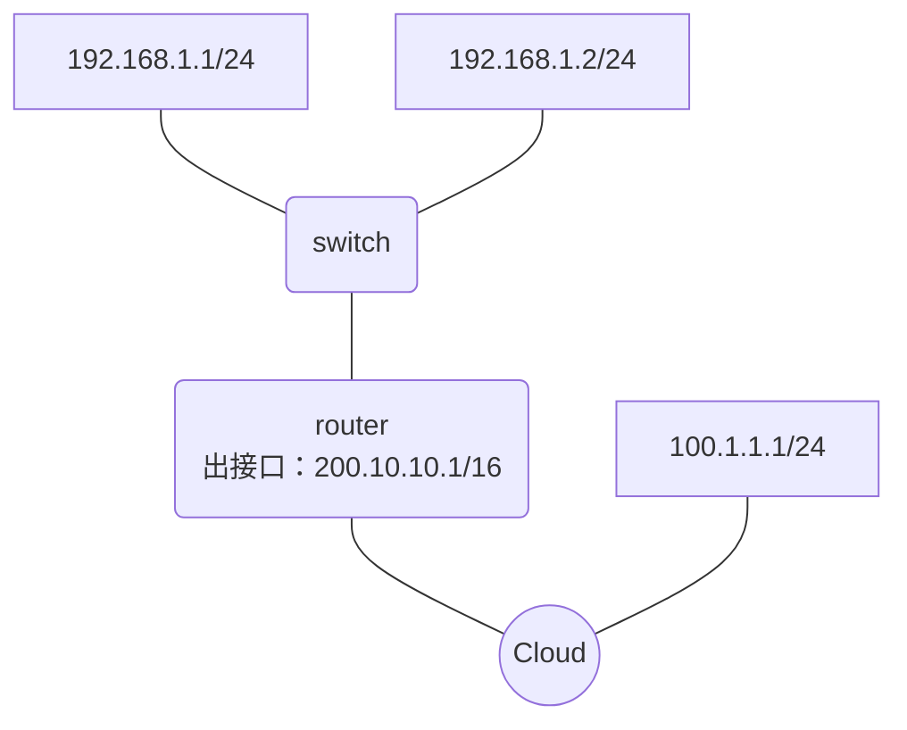

# IPv4

Internet Protocol version 4.

采取固定的 32 位，写法：`xxxx.xxxx.xxxx.xxxx`，一个 xxxx 即 1 个字节（8 个位）。

## What is IP

目的：在网络（具体指 Network Layer）上唯一标识一个通信方

位置：在整个 OSI 模型上处在承上启下的关键位置

## IP 类型

目的：方便构造出不同容量的网络自治系统

其中，IP 全 0 的地址是当前设备自标识地址（仅在当前设备里），全 1 的地址是全播地址。

### A 类

网络号 全 0 和 全 1 被保留。终端号 全 0 即代表它处在的网络号，全 1 代表它处在的网络里的全播地址。（下面的 B 和 C 也一样）

`[1.0.0.1, 127.255.255.254]`：前一段：网络号（最大 `2**7 - 2 = 126` 个），下三段：本地终端号（最大 16777214 个）。

### B 类

`[128.0.0.1, 191.255.255.254]`：前两段：网络号（最大 `2**14 = 16384` 个），下两段：本地终端号（最大 65534 个）。

### C 类

`[192.0.0.1, 223.255.255.254]`：前三段：网络号（最大 `2**21 = 2097152` 个），下一段：本地终端号（最大 254 个）。

### D 类

`1110*`的地址，保留。

### E 类

`1111*`的地址，保留。

### 私有地址

仅活跃在本地本局域网内的 IP，外发时将被路由器拦截掉。（私有地址与掩码不相关，`192.168.1.1/24` 和 `192.168.1.1/16` 都是私有地址）

- A 类的：`[10.0.0.0, 10.255.255.255]` 即 `10.0.0.0/8`
- B 类的：`[170.16.0.0, 172.31.255.255]` 即 `172.16.0.0/12`
- C 类的：`[192.168.0.0, 192.168.255.255]` 即 `192.168.0.0/16`

## Enhanced IPv4 with subnet mask

实现任意的 IP 类型（网络号 + 终端号），从而实现自己的子网。

## Enhanced IPv4 with NAT

目的：

1. 隐藏内部地址（最早的目的）
2. 解决 IPv4 地址不足的问题

### static NAT

私有地址和公网地址一一对应（路由器出口维持着这些映射关系），只能隐藏内部网络，不能解决地址不足的问题。

```txt
<router> nat set --static --internal=192.186.10.10  --external=200.10.10.10

```

### dynamic NAT

地址池维持的私与公的相互转换，与 static NAT 一样也不能解决地址不足的问题。

```txt
<router> rem 创建一个 NAT 地址池
<router> nat set --name=nat_aa --address-pool="12.1.1.10, 12.1.1.20"
<router> rem 创建一个 ACL，匹配需要被 NAT 转换的内网 IP
<router> acl set --name=acl_aa --permit="10.1.1.0/8"
<router> rem 把 ACL 放到 NAT 里，port 是 0 表示不转换端口
<router> nat set --filter=acl_aa --pool=nat_aa --port=0

```

### NATP (NAT with Port)

真正解决地址不足的问题：能让多个内部地址映射到同一个共有地址的不同端口上。

图示：



- PC1 的 s=192.168.1.1:1025 d=100.1.1.1:80 经过出口变成 s=200.10.10.2:2025 d=100.1.1.1:80
- PC2 的 s=192.168.1.2:1026 d=100.1.1.1:80 经过出口变成 s=200.10.10.2:2026 d:100.1.1.1:80

配置上和 dynamic NAT 一样，只不过不再需要 `--port=0` 参数，而且也不再需要多个共有地址，现在只需要一个即可。

## IPv6

将 32 位增到 128 位，从根本上解决 IP 地址不足的问题。
