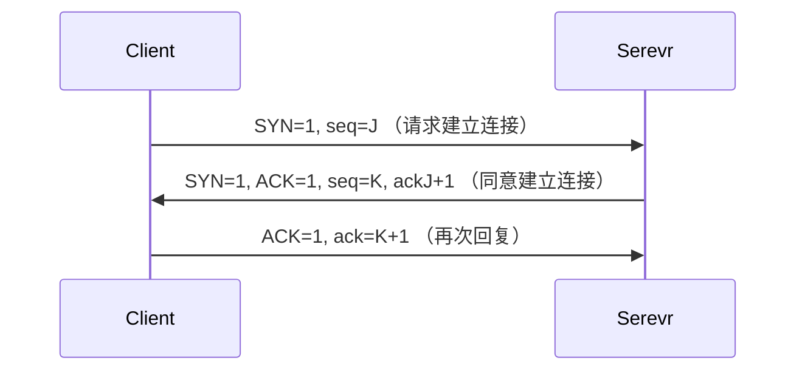
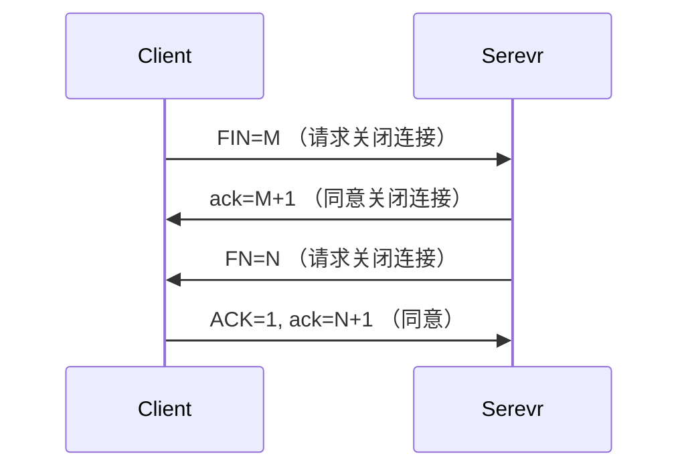

# TCP

TCP 提供面向已连接的信息通信（全双工），意味着双方要通信时，必须要建立连接，不再需要通信时，也必须要关闭连接，而且每一次的通信都需要双方验证是否收到，这是一种可靠网络通信方式。

OSI(Open System Interconnection) 网络模型：

1. 物理（铜制网线、光纤）
2. 数据链路（不同物理实体有不同的传输协议）
3. 网络
4. 传输
5. 会话
6. 表示
7. 软件

OSI 模型很细致很理想化，但是不适合实践，因此在它的基础上提出了 TCP/IP 的 4 级模型：

1. 网络接口（物理 + 链路）
2. 网络（IP、ARP）
3. 传输（TCP、UDP）
4. 软件（HTTP、FTP、TELNET、SMTP）

信息向下传递时，下一级都会将上一级传来的数据当作它的报文体，同时附上它自己协议的报文头，向上传递时，相反的过程。

## 图示

详细：

1. Client 向 Server 请求连接 TCP 连接，将请求报文的 SYN 标志位置 1，同时发送一个随机数 seq=J，此时 Client 进入 SYN_SENT 状态
2. Server 如果同意建立连接，也将 SYN 标志位置 1，同时还将 ACK 标志位置 1（表示已收到），将发来的随机数 +1，同时自己也发送一个随机数 ack=K，此时 Server 进入 SYN_RCVD 状态
3. Client 再次回复，ACK 置 1，ack 是发来的随机数 +1，此时 Client 进入 ESTABLISHED 状态
4. Server 收到此信息也随之进入 ESTABLISHED 状态，至此 TCP 的请求建立结束

为什么建立需要上次的回复？类比：

1. “喂！你在吗？”
2. “我在！你还在吗？” （需要保证此时发起方依旧还在，防止网络堵时，对方已经挂掉了却建立起了连接，而此连接是单向的（对方早已不在了））
3. “我还在！让我们继续沟通吧！”

## 图示

详细：

1. Client 进入 FIN_WAIT_1 状态，表示我没东西要给你了
2. Server 进入 FIN_WAIT_2 状态，我同意了你的关闭请求，但是此时 Server 还不能直接关闭，可能 Server 还有一些东西要发出去，因此此时不能直接回复 ACK
3. Server 进入 LAST_ACK 状态，表示我也没东西要给你了
4. Client 进入 TIME_WAIT 状态，大约有 2 倍的 MSL（报文最大生存时间）时间来接收那些被堵住的 Server 发来的报文，时间过了 Client 便也将关闭
5. Server 收到 ACK，便关闭连接（正常来说）
