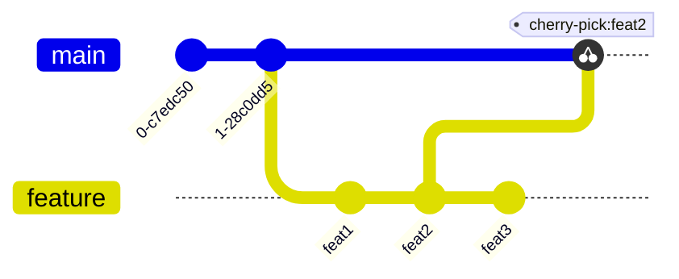

# Git 相关

**Git 官网：https://git-scm.com/**

**图解 Git 基本操作：http://marklodato.github.io/visual-git-guide/index-zh-cn.html**

**Git 操作建议使用可视化工具，比如 VSCode 的 GitLens 和 GitGraph 插件，和跨平台的 SourceTree。**

## 合并

main：主干分支
feature：开发分支，需要合到 main 的分支

### fast-forward merge

自 feature 分支从 main 创建出来后，main 分支再也没有提交过，此时 feature 合到 main 将执行快速合并，即直接将 main 分支的指针指向 feature。
可以使用`--no-ff`开关禁止快速合并，将会创建一个合并 commit（此 commit 的内容和 feature 最新的 commit 一样）。

### no-ff merge

自 feature 分支从 main 创建出来后，main 分支也提交过 commit，比如线上 bug 紧急修复的 commit，此时 feature 合到 main，由于 Git 无法知道应该使用哪个分支的数据，故将两个分支最新的版本尝试进行合并，如果有文件存在冲突（比如 main 和 feature 的最新版本都对`Home.vue`的第 20 行做了修改），就必须手动解决冲突（采用 main 的版本还是 feature 的版本，亦或者两者都采用），同时提交一个合并 commit。

### squash merge

传统的 merge（即 --no-ff merge）提交的合并 commit 存在两个父 commit 引用，一个指向 main 一个指向 feature，而使用 squash merge 的方式，合并 commit 只存在一个指向 main 的父 commit 引用，毕竟 feature 作为需求开发分支，一旦合入了 main 分支，就没有存在的必要了（应当定期删除一些不再使用的 feature 分支）。

### cherry-pick

将一个或多个 commit 在当前分支上重做。

图示：（gitGraph 的 cherry-pick 需要 [mermaid](https://cdn.jsdelivr.net/npm/mermaid@9.1.3/dist/mermaid.min.js) >= 9.1.3）

main 只需要 feature 分支名为"feat1"的那次 commit 提交，就可以使用 cherry-pick 命令。

### rebase

在 main 分支重做 feature 分支的全部提交，本质就是自动化的 cherry-pick 操作，使得原本非线性的常规合并(--no-ff)变地线性化。
提交历史看上去，feature 分支就好像直接从 main 分支开发的一样，也就是变基，即 rebase。

## 恢复

### reset

重置到某一个历史提交的版本。

`reset --soft historyCommitHash`：只将工作区的版本重置到此 commit 对应的版本，暂存区和版本库不会被重置

`reset --mixed historyCommitHash`：将工作区和暂存区的版本都重置到此 commit 对应的版本，版本库不会被重置（reset 命令的默认模式）

`reset --hard historyCommitHash`：将工作区、暂存区和版本库都重置到此 commit 对应的版本（风险命令！它将重置版本库到一个历史提交的版本，导致此历史提交的后面提交记录全部丢失，这些不再被引用的历史提交将在下次 Git 仓库 GC 的时候被删除，无法再找回这些历史提交！）

### revert

**重做**某一次有错误的提交，这样历史记录永远是前进的，不会像`reset --hard`一样丢失历史提交记录。

`git revert historyCommitHash`：对当前工作区重做此历史提交，两个重做操作和当前工作区文件没有冲突将自动提交一个重做 commit，否则需要手动解决冲突，可以使用开关`-n`或`--no-commit`禁止无冲突自动提交 commit，类似于`--no-ff`。

### restore

还原文件：`git restore [--wroktree] [--staged] [--source fromSource] [files | .]`

- --wroktree | -W：将文件还原到工作区，默认选项
- --staged | -S：将文件还原到暂存区
- --source | -s：指定还原文件来源，可选的值有[historyCommitHash, branchName, tagName]

  1. 如果没有指定 source，但是指定了 staged，就从 HEAD 还原暂存区
  2. 如果没有指定 source，也没有指定 staged，就从暂存区还原到工作区

- files：还原文件的列表（空格分隔），或一个 glob 表达式，或一个`.`表示全部

### commity --amend

用新的 commit 替换掉上一次提交的 commit（比如上一次 commit 有错误，但是又不想保留上一次的 commit 记录）。

## 远端

一个本地仓库通常会与一个或多个远端仓库相互关联（即 Git 的分布式思想），这些仓库都是等价的，能够相互替换。
当然，服务器端仓库（比如 GitHub）不需要工作区和暂存区，只需要一个版本库即可，这种仓库也叫做 bare repo（使用`git init --bare`即可创建），不过，现在很多服务端仓库提供了在线代码编辑的功能，此时就会为此仓库创建出对应的工作区和暂存区。

由于一个远端仓库是一个 URL（https 协议或 git 协议），而 URL 都较长（比如https://github.com/Vladimirirr/MyAwesomeCareerBlogs），为此，Git允许为特定的远端URL取一个别名，默认的别名就是`origin`。

`git remote add remoteName URL`：新建一个远端别名（简称远端）
`git remote remove remoteName`：删除一个远端
`git rename oldName newName`：重命名一个远端
`git remote -v`：显示全部远端
`git remote show remoteName`：显示一个远端的详细信息
`git remote prune origin`：取消本地分支对对应的远端已经不存在的分支关联，可以配合`git branch -a`查看全部分支（本地和远端）的状态，再删除这些被取消关联的本地分支

## Git 的基本思想概述

特点：

- 分布式：Git 基于分布式的思想，每个 Git 仓库都是对等体（高容灾性，每个克隆和同步此仓库的终端都是一次备份），不像 SVN 的基于集中式思想（低容灾，要定期备份服务端版本库）
- 快照：每一次的提交都是创建变化的文件集合的副本（保存为一个叫做`commit object`的二进制文件在`./.git/objects/`目录下），不像 SVN 的基于文件变化差量的提交
  - 基于快照的提交会占用较多的版本库（Git 有优化，比如压缩、对变化很小的文件不做快照而是保存变化差量），但是在间隔很长的两次提交或分支之间切换很迅速
  - 基于变化差量的提交在每次文件改动不大的情况下能有效降低版本库占用的空间，但是在间隔很长的两次提交或分支之间切换，需要很长的时间来根据这些差量计算出当前需要的工作区的文件

`git add files...`：将工作区的文件放入暂存区（即将被提交的区域）
`git commit -m "comment"`：对当前暂存区生成一个版本快照（本质是一个`commit object`）并提交到版本库，版本库随之更新它的历史记录

更多底层原理参见《Pro Git》书的【Git 内部原理】章节。
