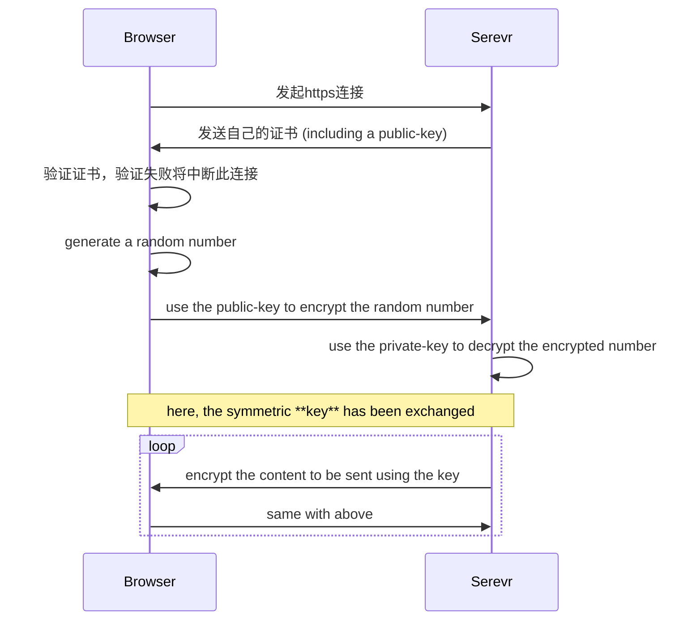

# HTTPS

## 概述

SSL(Secure Sockets Layer) = TSL(Transport Layer Security)，同一个东西的不同名字。

SSL 最早是 Netscape 公司发布的，而 TSL 是它的标准化，就像 JavaScript 与 ECMAScript 一样。

## 图示

仅建立过程（也是 key 交换的过程）采取非对称（比如 RSA、ECC），通信过程采取对称（比如 DES、AES），对称比非对称的效率更高，而且安全性也不比非对称差多少。

## 常见的非对称

非对称主要工作在：密码交换 和 数字签名（身份认证）

真正的传输内容建议对称（效率高），对称的 key 可以每隔一段时间换一次以提高安全性。

1. RSA：大整数上的因子组合问题 【1977 年】
   两个**很大的素数**相乘得到的结果**很难再倒推回去**
2. DSA：整数有限域上的离散对数问题 【1991 年】
3. ECC：椭圆曲线上的离散对数问题 【1985 年】

攻击难度、生成速度、硬件消耗：ECC > DSA > RSA

## 常见的对称

攻击难度（高 -> 低）：

1. AES - Advanced Encryption Standard
2. Blowfish
3. Rabbit
4. 3DES - Triple DES
5. DES - Data Encryption Standard
6. RC4 - Rivest Cipher 4

## HTTPS 证书

### 获取

有下面这些证书发布组织：(The first one is Free and OpenSource.)

1. [Let's Encrypt](https://letsencrypt.org)
2. DigiCert
3. GeoTrust
4. Comodo
5. GlobalSign
6. RapidSSL
7. Thawte
8. Symantec

### 自签名证书

自签名证书指的是采取自己的 private-key 对证书签名，而不是向受信任的证书发布组织(CA, Certificate Authority)申请证书。自签名证书不受任何权威组织的信任。自签名证书主要在测试环境验证软件，但不要上到线上环境。

操作系统和浏览器都自带了权威的受信任的根证书，你可以把你的自己的证书也加入到操作系统或浏览器里（需要管理员权限），这样浏览器访问此证书签名的网站时就会显示此网站是安全的。

自签名证书不安全指的是不被广泛的设备信任，而不是此证书本身不安全，如果你制作生成的证书被妥善保管，那么你与设备间的通信不会遇到中间人的攻击。
