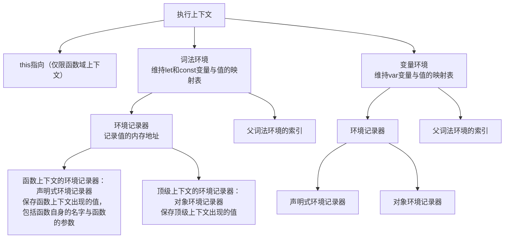

# JavaScript 执行上下文

执行上下文：被执行的函数域、块域和顶级域

```mermaid
flowchart TD

ctx["执行上下文"] --> thisBind["this指向（仅限函数域上下文）"]
ctx["执行上下文"] --> lexicalEnv["词法环境\n维持let和const变量与值的映射表"]
lexicalEnv --> lexicalEnvRec["环境记录器\n记录值的内存地址"]
lexicalEnvRec --> lexicalEnvRecClaim["函数上下文的环境记录器：声明式环境记录器\n保存函数上下文出现的值，包括函数自身的名字与函数的参数"]
lexicalEnvRec --> lexicalEnvRecObject["顶级上下文的环境记录器：对象环境记录器\n保存顶级上下文出现的值"]
lexicalEnv --> lexicalEnvExternalEnv["父词法环境的索引"]
ctx["执行上下文"] --> varEnv["变量环境\n维持var变量与值的映射表"]
varEnv --> varEnvRec["环境记录器"]
varEnvRec --> varEnvRecClaim["声明式环境记录器"]
varEnvRec --> varEnvRecObject["对象环境记录器"]
varEnv --> varEnvExternalEnv["父词法环境的索引"]

```
