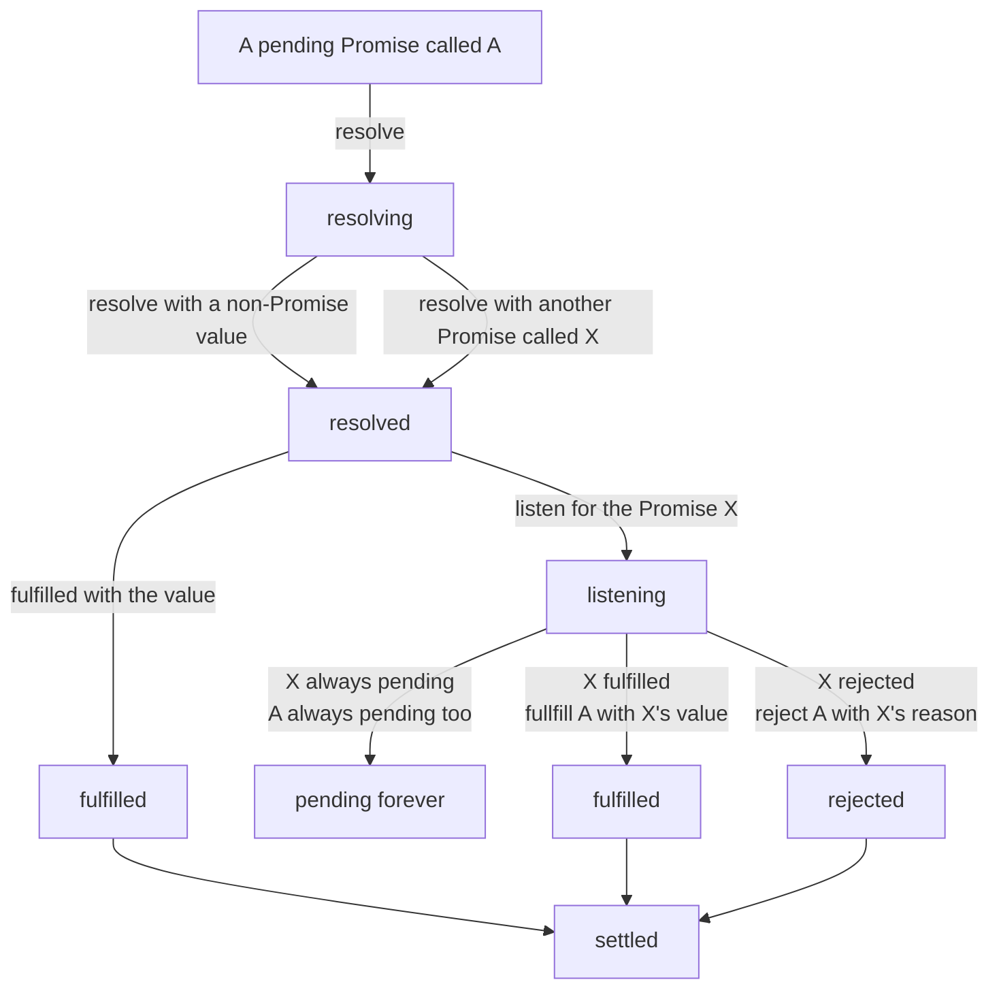
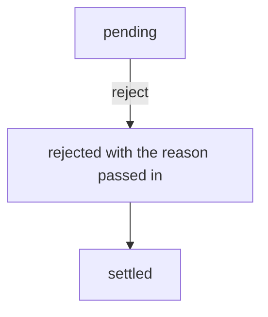

# Promise

Promise 的出现与最佳实践。

A Promise represents the eventual result(completed or failed) of an asynchronous operation, in other words, a Promise is a future value for an asynchronous operation.

本文不考虑 [Thenable](https://developer.mozilla.org/en-US/docs/Web/JavaScript/Reference/Global_Objects/Promise#thenables)（在真正的 Promise 未出现前，JavaScript 社区对 Promise 的一种简易实现）。

文档：<https://developer.mozilla.org/en-US/docs/Web/JavaScript/Reference/Global_Objects/Promise>

标准：<https://tc39.es/ecma262/multipage/control-abstraction-objects.html#sec-promise-objects>

## Callback (Traditional callback-based asynchronous operations)

关键词：失去控制、失去信任、嵌套地狱

失去控制和失去信任的代码示例：

```html
<script type="module">
  // 我们的支付系统
  import checkout from './our/payment/system/index.js'
  // 一个组件，但是来自一个其他系统
  import SubmitBtn from './third/part/components/SubmitBtn.js'
</script>
<template>
  <!-- 我们的购物车组件的模板 -->
  <div class="goodsList">
    <!-- 商品列表 -->
  </div>
  <div class="operations">
    <!-- 操作按钮组 -->
    <submit-btn id="payBtn">支付</submit-btn>
  </div>
  <script>
    const payBtn = document.getElementById('payBtn')
    // 我们把支付函数传入了其他系统的代码里，我们只能祈祷此系统不会出错，祈祷它能正常地执行我们传入的callback！
    // 不要少执行、也不要多执行、也希望传入对的参数（即，下面的参数e是符合格式的，它的data也是支付系统可以识别的格式）！
    // 这就是失去控制（我们不再是callback的控制者）、失去信任（失去控制导致的），我们失去了对我们自己代码（即callback）的控制和信任！啊，这糟糕极了！
    // 如果它的click执行了好多次callback，那么我们就会受到客户的投诉（为什么我的钱包多扣了钱）！
    // 虽然我们可以在callback里设置一重重的检查器（比如，设置一个外部变量来记录执行的次数），但这大大地增加了我们代码的可读性，反而使得我们的软件变得复杂难懂，而且很冗余！
    payBtn.addEventListener('click', (e) => checkout(e.payData))
  </script>
</template>
```

嵌套地狱的代码示例：

```js
// 采取一个很简单的前端工具库 -- jQuery
// $是jQuery的简写标识符
// $.ajax是jQuery对XHR的封装，类似axios
$.ajax({
  path: 'first',
  data: 'initial',
  success: (res) => {
    console.log('first returned', res)
    $.ajax({
      path: 'second',
      data: res.data,
      success: (res) => {
        console.log('second returned', res)
        $.ajax({
          path: 'third',
          data: res.data,
          success: (res) => {
            console.log('third returned', res)
            // 我们的second必须依赖first返回的结果
            // 同样，third必须依赖second返回的结果
            // 这样它们就被一次次地嵌套，或许还可能继续嵌套下去，天呐，我的显示器不够宽了！
          },
        })
      },
    })
  },
})
```

## Promise

关键词：控制反转、信任反转、代理、中立、一次性、链式

控制反转、信任反转、代理、中立、一次性的代码示例：

```html
<script>
  // 控制反转、信任反转：我们的callback的控制权依旧是我们的，而且我们可以信任callback执行的次数和传入的参数
  // 代理、中立：其他系统代码与我们的callback被一个中立的代理者控制着
  // 一次性：其他系统代码只能返回一次结果（即Promise里的决议术语），即便将来它继续返回结果也将被代理者忽略

  // 依旧是我们的支付按钮
  const payBtn = document.getElementById('payBtn')
  // 我们请出我们的代理者，即Promise
  const promise = new Promise((resolve) => {
    // 此函数在代理者创建完成时立刻执行
    // 我们把resolve传入到其他系统的代码里（即，我们的callback不再是我们的支付函数，而是代理者的决议标识函数），resolve表示决议此Promise，而且只有首次的resolve有效，这就是控制反转，Promise让对我们的callback的操作又回到了我们自己的代码里，耶！
    payBtn.addEventListener('click', resolve)
  })
  promise.then((res) => {
    // 这里才是我们真正的支付函数，此函数没有传给其他系统的代码里，而是传给了代理者，而代理者在我们的代码控制下！
    // 静静地等待我们的客户按下支付按钮
    // 最终，我们支付此订单
    checkout(res.data)
  })
</script>
```

链式的代码示例：

```js
// 假设$.ajax.withPromise是ajax的Promise变体
$.ajax
  .withPromise({
    path: 'first',
    data: 'initial',
  })
  .then((res) => {
    console.log('first returned', res)
    return $.ajax.promise({
      path: 'second',
      data: res.data,
    })
  })
  .then((res) => {
    console.log('second returned', res)
    return $.ajax.promise({
      path: 'third',
      data: res.data,
    })
  })
  .then((res) => {
    console.log('third returned', res)
    // 哈哈，现在它们没有被嵌套，而是自上而下地书写，读起来轻松多了！
    // 书写思维从 嵌套 -> 链式 转变！
    // 这棒极了！
  })
```

## Promise under Generator

关键词：以同步地思维继续书写非同步代码

详见[autoRun](../Generator/autoRun.test.html)。

语法糖：

```js
const foo = async () => {
  const firstRes = await $.ajax.withPromise({
    path: 'first',
    data: 'initial',
  })
  // 上面的await关键词告知foo函数，你需要等待此Promise返回结果（决议）才能继续向下执行！
  console.log('first returned', firstRes)
  const secondRes = await $.ajax.withPromise({
    path: 'second',
    data: firstRes.data,
  })
  console.log('second returned', firstRes)
  const thirdRes = await $.ajax.withPromise({
    path: 'third',
    data: secondRes.data,
  })
  console.log('third returned', firstRes)
  // 看到了没！现在非同步代码以同步的方式书写出来了，它们可以和同步的代码写在一起，就好像它们也变成了同步的代码一样！
  // 太奇妙了！
}
```

## Promise report time

On microtask lifecycle in each EventLoop, JavaScript engine will check all existed promises:

1. 如果此 Promise 已拒绝，且还没有任何 onRejected 处理器处理过它，将在控制台报告此 Promise，即 `Uncaught (in promise) Error: xxxx`
2. 如果此 Promise 已决议，且存在还未被调用过的处理器，那么这些处理器将被执行

## Promise status

Promise 的状态变化是单一方向的，即，pending 要么变到 fulfilled（通过 resolve 方法），要么变到 rejected（通过 resolve 或 reject 方法），要么不变。

Promise 的状态是不可逆转的，即，一旦变到了 fulfilled 或 rejected（统称 settled），再也不可能变回到 pending。

### 术语

- `pending 挂起`：Promise 的结果还是未知的
- `resolve 解决`：尝试去解决一个 Promise，结果可能是 fulfilled，也可能是 rejected，甚至是 pending，取决传入给 resolve 方法的参数
- `reject 拒绝`：直接拒绝此 Promise
- `resolved 已解决`：resolve 了的 Promise
- `fulfilled 已成功、已完成`：Promise 已经有了结果，是一个成功的结果
- `rejected 已拒绝、被拒绝`：Promise 已经有了结果，是一个失败的结果
- `settled 已决议`：Promise 已经有了结果，即已经决议

### 状态变化

#### resolve 导致的变化



#### reject 导致的变化



#### 变化说明

1. 有一个 Promise，它已经做好了某一件事，那么 resolve 它，让它从 pending 变到 fulfilled，同时传入一个 value 表示此事的结果
2. 有一个 Promise，它未能做好某一个事，那么 reject 它，让它从 pending 变到 rejected，同时传入一个 reason 表示它为什么没有做好此事

## APIs

[Promise APIs.](./APIs.md)

## 总结

Promise 目的：使非同步任务**可控制可信任**且**高效地链式组合**的技术

传统基于回调函数的非同步任务解决方案的缺点：

1. 不可信任，将 callback 传给其他 api，如果此 api 有潜在的 bug 将影响到此 callback，比如此 api 没有正常地执行传给它的 callback（过多或过少地执行、或根本没有执行、或执行传入的参数不符合预期、等等）
2. callback 的嵌套写法带来的死亡金字塔代码（嵌套地狱）

Promise 如何解决：

1. 创建一个 promise，由此 promise 代理此 api 的状态变更和对应的 callback
2. 支持链式语法
