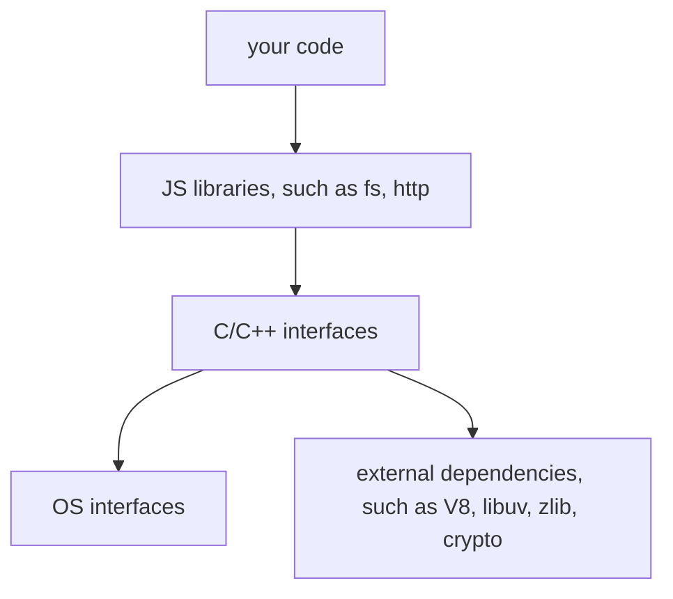

# EventLoop in Node.js

> 参考：<https://www.builder.io/blog/visual-guide-to-nodejs-event-loop>

## 单线程的 JavaScript

JavaScript 是一门 同步的、阻塞的、单线程的 语言，这就是 JavaScript 的设计思想，因此任何符合 JavaScript 标准的 Runtime 里有且只有一个 JavaScript 引擎。

但是，我们可同时创建多个这样的 Runtime 来实现（模拟）多线程，比如，浏览器端的 [WebWorker](https://developer.mozilla.org/en-US/docs/Web/API/Worker)、Node.js 的 [Cluster](https://nodejs.org/dist/latest-v19.x/docs/api/cluster.html)。

目前，非浏览器的 JavaScript Runtime 的各种 API 语法都在向浏览器端靠拢（统一 JavaScript 在跨平台时的 API 格式），因此 Node.js v10.5.0 支持了 WebWorker，而 Deno.js 从诞生时就已经支持。

### 其他

1. Node.js 还存在 [child_process](https://nodejs.org/dist/latest-v19.x/docs/api/child_process.html) 模块，它让 C++ 帮忙来创建一个真正的线程去执行一串代码或一个可执行文件，同时等待它的返回：

   ```js
   const { exec } = require('child_process')

   // 执行一个 CMD 命令
   exec(`DIR /B`, (error, stdout, stderr) => {
     if (error) {
       console.error(error)
     } else {
       console.log(`stdout: \n${stdout}`)
       console.error(`stderr: \n${stderr}`)
     }
   })
   ```

## Node.js 的构成



其中 libuv 最重要，它是一个跨平台的 asynchronous I/O library，它封装了多个平台（Windows、Linux、POSIX、等等）的低级 asynchronous I/O 方法，如果 libuv 遇到当前平台不支持的方法，将创建一个单独的线程去执行它对应的 synchronous 方法。

## Node.js 的 EventLoop 工作方式

All synchronous code takes precedence over asynchronous code. This means that **the EventLoop will work only when the call stack is empty**.

When we come into the EventLoop, each cycle(aka tick) is like the following:

1. All callback in the microtask queue are executed, first nextTick queue and then promise queue.
2. All callbacks in the timer queue are executed.
3. Check the microtask queue.
4. All callbacks in the I/O queue are executed. Check if there are any completed I/O tasks reported by libuv, and if so, push them into this queue, but wait for the next EventLoop.
5. Check the microtask queue.
6. All callbacks in the check queue (such as setImmediate's callbacks) are executed.
7. Check the microtask queue.
8. All callbacks in the close queue (such as fs.close's callbacks) are executed.
9. Check the microtask queue.

The official document of Node.js suggests using `process.nextTick()` for two main reasons: to handle errors or to allow a callback to run after the call stack has unwound but before the EventLoop continues.

## 测试

### test 01

```js
process.nextTick(() => console.log('process.nextTick 1'))
process.nextTick(() => {
  console.log('process.nextTick 2')
  process.nextTick(() => console.log('inner nextTick'))
})
process.nextTick(() => console.log('process.nextTick 3'))

Promise.resolve().then(() => console.log('Promise.resolve 1'))
Promise.resolve().then(() => {
  console.log('Promise.resolve 2')
  process.nextTick(() =>
    console.log('another inner nextTick but in Promise.then')
  )
})
Promise.resolve().then(() => console.log('Promise.resolve 3'))
```

```txt
process.nextTick 1
process.nextTick 2
process.nextTick 3
inner nextTick
Promise.resolve 1
Promise.resolve 2
Promise.resolve 3
another inner nextTick but in Promise.then
```

### test 02

```js
setTimeout(() => console.log('setTimeout 1'))
setTimeout(() => {
  console.log('setTimeout 2')
  process.nextTick(() => console.log('inner nextTick in setTimeout'))
})
setTimeout(() => console.log('setTimeout 3'))

process.nextTick(() => console.log('process.nextTick 1'))
process.nextTick(() => {
  console.log('process.nextTick 2')
  process.nextTick(() => console.log('inner nextTick in nextTick'))
})
process.nextTick(() => console.log('process.nextTick 3'))

Promise.resolve().then(() => console.log('Promise.resolve 1'))
Promise.resolve().then(() => {
  console.log('Promise.resolve 2')
  process.nextTick(() => console.log('inner nextTick in Promise.then'))
})
Promise.resolve().then(() => console.log('Promise.resolve 3'))
```

```txt
process.nextTick 1
process.nextTick 2
process.nextTick 3
inner nextTick in nextTick
Promise.resolve 1
Promise.resolve 2
Promise.resolve 3
inner nextTick in Promise.then
setTimeout 1
setTimeout 2
inner nextTick in setTimeout
setTimeout 3
```

### test 03

```js
const fs = require('fs')

fs.readFile(__filename, () => {
  console.log('readFile 1')
})

process.nextTick(() => console.log('process.nextTick 1'))

Promise.resolve().then(() => console.log('Promise.resolve 1'))

setTimeout(() => console.log('setTimeout 1'))

setImmediate(() => console.log('setImmediate 1'))

// here we take a long time to make sure the timer has been timeout
for (let i = 0; i < 9e4; i++) {
  const blackhole = new Date().toLocaleDateString()
}
```

```txt
process.nextTick 1
Promise.resolve 1
setTimeout 1
setImmediate 1
readFile 1
```

按理来说，I/O 的 callback 在 EventLoop 里比 setImmediate 的优先，但是输出不是如此。

I/O 函数与其他的安排函数不同，其他的函数在执行时，会立刻把它的 callback 放到它的队列里，比如，当执行 `process.nextTick(callback)` 时，此 callback 会立刻被放到 microtask-nextTick 队列里。但 I/O 函数不会，它只是简单的告知 I/O 模块需要做一些读写文件。当 EventLoop 检查到 I/O 队列时，它只会执行已经存在的 callbacks，再是尝试检查是否有已经完成的 I/O，有的话，就将这些 callbacks 将放到此队列（不过要等到下次 EventLoop 检查到这时它们才会被执行）。

### test 04

```js
setImmediate(() => console.log('setImmediate 1'))
setImmediate(() => {
  console.log('setImmediate 2')
  process.nextTick(() => console.log('process.nextTick 1'))
  Promise.resolve().then(() => console.log('Promise.resolve 1'))
})
setImmediate(() => console.log('setImmediate 3'))
```

```txt
setImmediate 1
setImmediate 2
process.nextTick 1
Promise.resolve 1
setImmediate 3
```

### test 05

```js
setTimeout(() => console.log('setTimeout 1'), 0) // 0 可以省略，表示希望尽快执行 callback（当然具体什么时候，及是否会被推迟，都取决 Node.js 的具体安排）
setImmediate(() => console.log('setImmediate 1'))
```

两条 log 输出不固定。CPU 的工作负荷会导致此类情况的出现，当 CPU 繁忙时 setTimeout 会被推迟。

### test 06

```js
const fs = require('fs')

const readableStream = fs.createReadStream(__filename)
readableStream.close()
readableStream.on('close', () => {
  // enqueue to the close queue
  console.log('close')
})

setImmediate(() => console.log('setImmediate'))
setTimeout(() => console.log('setTimeout'), 0)
Promise.resolve().then(() => console.log('Promise.resolve'))
process.nextTick(() => console.log('nextTick'))
```

```txt
nextTick
Promise.resolve
setTimeout
setImmediate
close
```

## Conclusion

The EventLoop is a C++ program that coordinates the execution of synchronous and asynchronous codes in Node.js, and manages all 6 different queues: nextTick, promise, timer, I/O, check and close.

The execution order for all queues is fixed, and it's important to note that the nextTick and promise queues are executed in between each queue and also in between each callback execution in the timer and check queues.
