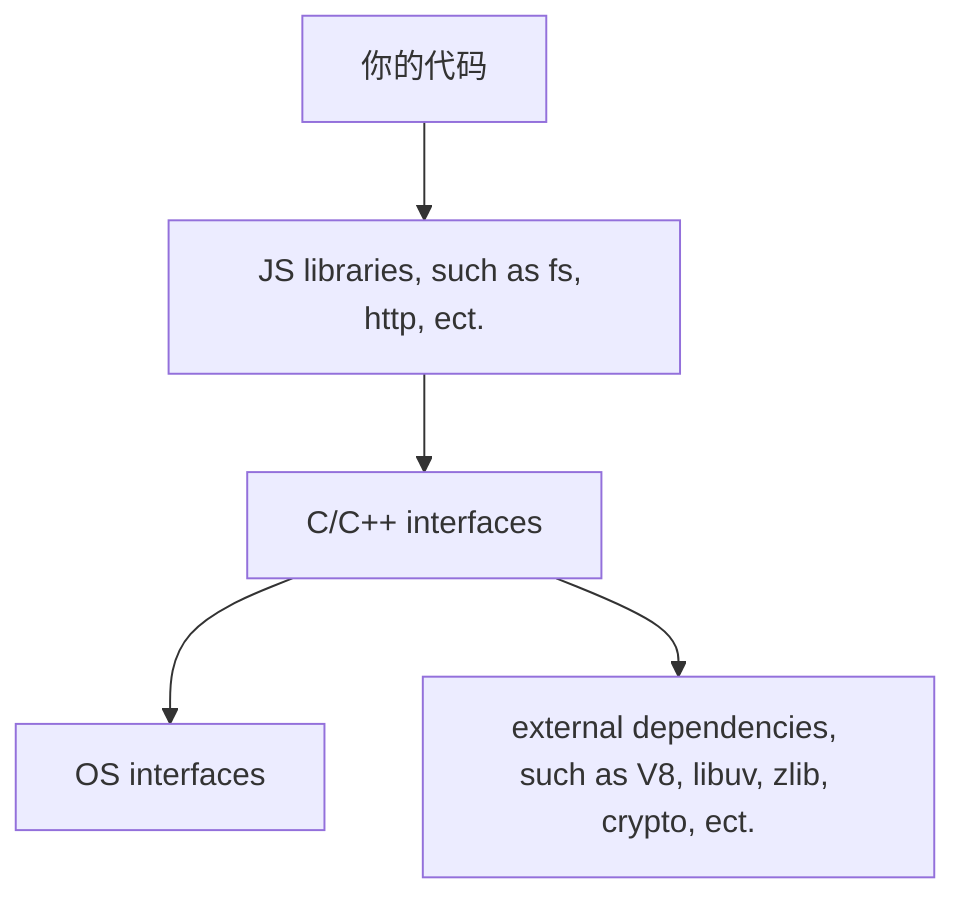

# EventLoop in node.js

JavaScript 是一门 同步的、阻塞的、单线程的 语言。

注意，WebWorker 不是 JavaScript 标准里的内容，而是 W3C 标准里的内容（由浏览器实现）。

node.js 的构成：

其中 libuv 最重要，它是一个跨平台的 asynchronous I/O library，它封装了多个平台（Windows、Linux、POSIX、等等）的低级 asynchronous I/O 方法，如果 libuv 遇到当前平台不支持的方法，将创建一个单独的线程去执行它对应的 synchronous 方法。

All synchronous JavaScript code takes priority over asynchronous code that the runtime would like to execute. This means that only after the call stack is empty does the event loop come into play.
When comes into the event loop, each loop cycle just likes below:

1. Any callbacks in the microtask queue are executed. First, tasks in the nextTick queue and then tasks in the promise queue.
2. All callbacks in the timer queue are executed.
3. Check the microtask queue again.
4. All callbacks in the I/O queue are executed.
5. Check the microtask queue again.
6. All callbacks in the check queue (such as setImmediate's callbacks) are executed.
7. Check the microtask queue again.
8. All callbacks in the close queue (such as fs.close's callbacks) are executed.
9. Check the microtask queue again.
