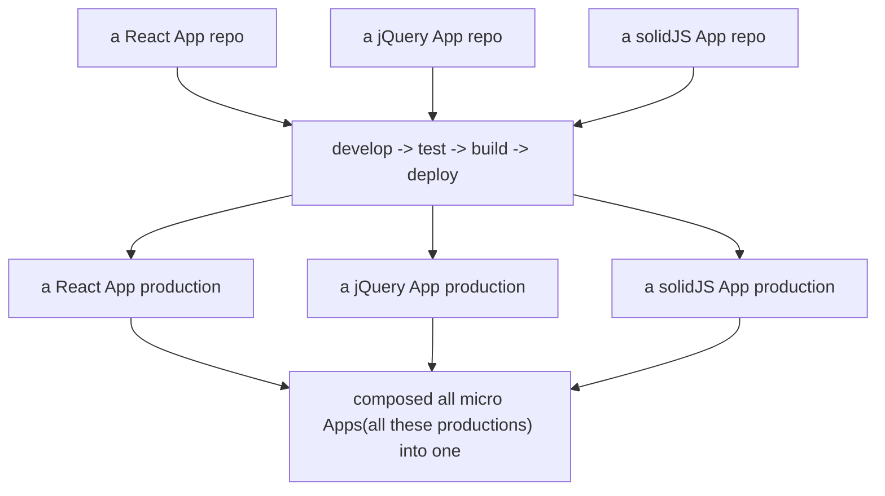

# 微前端

## 什么是微前端

Techniques, strategies and recipes for building a modern web app with multiple teams that can ship features independently.

微前端是一种多个团队通过独立发布功能的方式来共同构建现代化 web 技术的策略。

图示：

## 微前端的实现方式

### iframe

最经典的隔离方案。

比较笨重，但是是真正的隔离方案。

### WebComponents

采取 WebComponents 的 shadow 实现隔离。

兼容性：https://caniuse.com/?search=Web%20Components

### 父子

父容器需要管理隔离：

1. window 隔离
2. 样式隔离
3. ...

### JavaScript 沙箱技术 -- ShadowRealm（提案）

提案地址：https://github.com/tc39/proposal-shadowrealm
