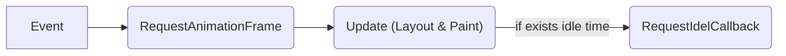

# BackgroudTasks

文档地址：<https://developer.mozilla.org/en-US/docs/Web/API/Background_Tasks_API>

低优先级任务，在浏览器空闲时执行。

## 概念

一个浏览器页面有且只有一个主线程，页面的全部操作都由此线程完成（布局与绘制、运行 JS 代码、收发事件、收发网络、与 OS 交互、等等），因此它非常繁忙。

其中，事件处理和画面更新是我们能注意到性能问题最直观的方式，因此我们的代码不能出现使主线程停滞的情况。之前，对于大任务只能交由 WebWorker，但现在，`requestIdleCallback` 方法可让浏览器告诉我们当前还有多少空闲的时间能给我们，而不会停滞主线程。

## 图示

一帧：



## 最佳实践

1. Use it for low priority tasks.
2. Idle callbacks shouldn't run out of its remaining time.
3. Avoid changing DOM in the idle callback.
4. Use the `timeout` option if needed.

## API

目前只有一个。

### requestIdleCallback

文档地址：<https://developer.mozilla.org/en-US/docs/Web/API/Window/requestIdleCallback>

示例：

```js
const theId = requestIdleCallback(
  (deadline) => {
    // 仅在设置了超时时间，且执行时已经超出了设置的超时时间，才true
    console.log('是否已经超时（此处9秒）', deadline.didTimeout)
    // 返回毫秒数，0表示没有了剩余空闲时间
    console.log('目前还剩的空闲时间', deadline.timeRemaining())
    // do something in remaining time, such as calculating, networking and so on, but not something that will change DOM
    // call requestIdleCallback again to schedule another callback in next
  },
  {
    // 指定超时时间，如果已经等待超出了9秒，那么会尽快安排此 callback 进入 EventLoop
    // 建议设置此选项，否则可能会很久才会执行你的 callback 如果主线程太过繁忙的话
    timeout: 9e3, // 可选
  }
)

// 如果需要取消
cancelIdleCallback(theId)
```

#### 兼容性

- Chrome >= 47(2015.12)
- FF >= 55(2017.08)
- Safari NoSupport(2023.12)
