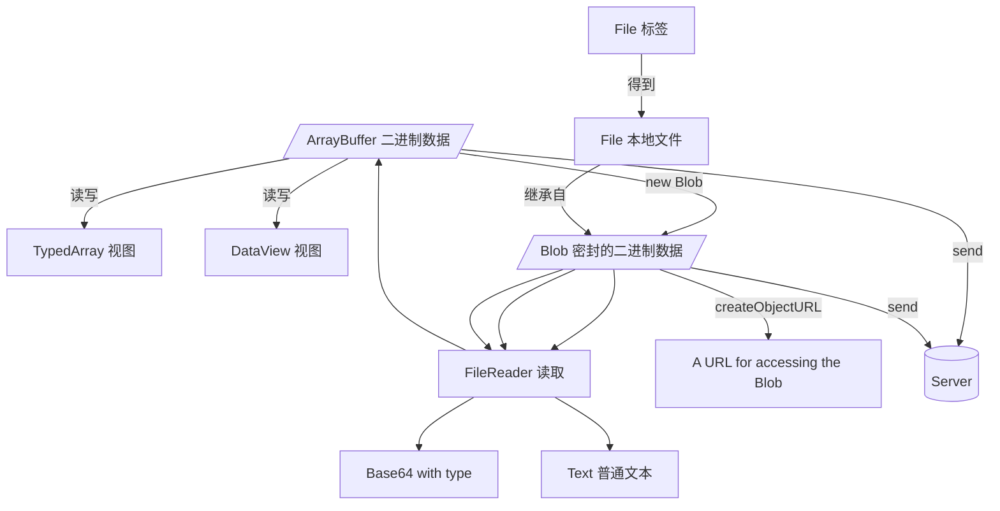

# JavaScript 操作二进制数据

## 直接看总结

[传送门！Go to Summary!](#summary)

## ArrayBuffer

表示一个固定长度的二进制数据缓冲区。一个字节数组。不能直接操作它，而是需要建立一个它的视图来间接地操作它。

The ArrayBuffer object is used to represent a generic raw binary data buffer with length fixed.

示例：

```js
// 创建了连续的固定的16字节的内存空间，使用 0 填充
// 一个类数组结构，但是不是数组！
const data = new ArrayBuffer(16)
```

相当 C 语言的：

```c
#include <stdlib.h>

int main(){
  void *p_data = calloc(/* num */16, /* size */1);
  return 0;
}
```

### properties and methods

- `ArrayBuffer.prototype.byteLength`: represents the length of an ArrayBuffer in bytes
- `ArrayBuffer.prototype.slice`: returns a new ArrayBuffer whose contents are a copy of this
- `ArrayBuffer.isView`: checks if the passed value is an ArrayBuffer view (TypedArray or DataView)

### 操作二进制数据

我们需要视图来访问与操作二进制数据。

#### 类型化数组 -- TypedArray

- Uint8Array = uint8
- Uint16Array = uint16
- Uint32Array = uint32
- Float64Array = float64 = double
- and more

TypedArray 的 BYTES_PER_ELEMENT 值表示它每个元素占据的字节个数。

TypedArray 有大量与 Array 相同的方法（比如，find、includes、indexOf、map、filter、reduce、等等），但是没有会导致数组长度变化的方法（比如，push、splice、等等）。

示例：

```js
// 内存数据
const data = new ArrayBuffer(16)
/**
 * 将其看作 32 bits (4 bytes) unsigned int
 * @param {ArrayBuffer}
 * @param {number?} byteOffset
 * @param {number?} byteLength
 */
const dataView = new Uint32Array(data)
// 写入一些值
dataView[0] = 10
dataView[1] = 20
dataView[2] = 30
dataView[3] = 40

console.log(data)
// 内存的小端方式存储的结果
// [10, 0, 0, 0, 20, 0, 0, 0, 30, 0, 0, 0, 40, 0, 0, 0]
```

相当 C 语言的：

```c
#include <stdlib.h>
#include <stdint.h>

int main(){
  void *p_data = calloc(/* num */16, /* size */1);
  uint32_t *p_data_with_uint32 = (uint32_t*) p_data;
  uint32_t *p_data_view = p_data_with_uint32;
  p_data_view[0] = 10;
  p_data_view[1] = 20;
  p_data_view[2] = 30;
  p_data_view[3] = 40;
  return 0;
}
```

#### 数据视图 -- DataView

与 TypedArray 相比，它更灵活，而且还能设置大小端模式。

```js
// 内存数据
const data = new ArrayBuffer(16)

/**
 * @param {ArrayBuffer}
 * @param {number?} byteOffset
 * @param {number?} byteLength
 */
const dataView = new DataView(data)
// set the data by uint32 and LittleEndian format
dataView.setUint32(0, 10, /* isLittleEndian */ true)
dataView.setUint32(4, 10, true)
dataView.setUint32(8, 10, true)
dataView.setUint32(12, 10, true)

console.log(data)
```

### 文档

ArrayBuffer: <https://developer.mozilla.org/en-US/docs/Web/JavaScript/Reference/Global_Objects/ArrayBuffer>

TypedArray: <https://developer.mozilla.org/en-US/docs/Web/JavaScript/Reference/Global_Objects/TypedArray>

DataView: <https://developer.mozilla.org/en-US/docs/Web/JavaScript/Reference/Global_Objects/DataView>

## Blob 与 File

继承关系：`File <- Blob <- Object`

ArrayBuffer 和 它的各种视图 都是 ECMAScript 的标准，而 Blob 和 File 不是，它们是 W3C 的标准。

它们都表示一个固定不变的且不可见的（密封的）二进制数据块（就像字符串一样，不能改变它，但是可以在它基础上创造一个它的变体），而 File 侧重表示此二进制数据块是一个本地上传的文件（标签 `input[type="file"]` 获取到的文件），File 继承自 Blob，在 Blob 的基础上多了 fileName、fileType、fileSize、fileLastModified 等与文件相关的值。

```js
/**
 * @param {Array<Blob | ArrayBuffer | string>} blobParts - blobParts 表示一系列其他 Blob 对象、ArrayBuffer 或 字符串
 * @param {Object} opts
 * @param {string} opts.mime
 * @param {'transparent' | 'native'} opts.endings - 字符串文本的换行符是否要转换，transparent 表示不转换，native 转换到当前操作系统的换行符（其中，Windows = \r\n、Unix-like = \n、旧MacOS = \r）
 */
const blobData = new Blob(['aabb'], { type: 'text/plain' })

/**
 * @param {number?} byteStart - 负数表示倒数
 * @param {number?} byteEnd - 负数表示倒数
 * @param {string?} mime - 新 blob 的 type，默认与父的相同
 */
const blobDataWithFirstTwoChars = blobData.slice(0, 2)

/**
 * 返回包含此 blob 数据的 ArrayBuffer 对象
 */
blobData.arrayBuffer(/* no params */).then((res) => console.log(res))

/**
 * 返回包含此 blob 数据的文本值（使用 UTF-8）
 * 与 FileRader.readAsText 相同，但是仅支持 UTF-8
 */
blobData.text(/* no params */).then((res) => console.log(res))

/**
 * 返回包含此 blob 数据的 ReadableStream 对象
 */
const readableStreamToTheBlob = blobData.stream(/* no params */)
```

可以使用`URL.createObjectURL`来为一个 blob 创建一个网络访问地址（诸如，`blob:http://127.0.0.1/1e65100e-860d-aaa5-89ae-6ab0cbee6217`），注意的是，当不再需要访问此 blob 资源时，要使用`URL.revokeObjectURL`来清空它占的内存。

### 文档

Blob: <https://developer.mozilla.org/en-US/docs/Web/API/Blob>

Blob 和 File 的 W3C 标准: <https://www.w3.org/TR/FileAPI/>

## Base64

使用 64 个可读字符表示和传输二进制数据（让这些数据在各个网关间传输而不必转换格式，因为载体是最基本的可读字符），但是这也使得数据变大 33%。

浏览器有内置的操作 Base64 的方法，[btoa 与 atob](/articles/%E6%B5%8F%E8%A7%88%E5%99%A8%E6%8A%80%E6%9C%AF/APIs.md#btoa%20%E4%B8%8E%20atob)。

### DataURL

DataURL 是 Base64 的衍生，将 Base64 的`/`和`+`（与 URL 的特殊字符冲突）变成`*`和`-`，在网络上传输带有格式的 Base64 数据。

格式：`data:[mime][;base64],<data>`

## FileReader

FileReader 从一个 Blob 或 File 数据对象里读取内容（读取的结果可以是 ArrayBuffer、Base64、Text 或 BinaryString）。

其中 BinaryString 是非标准的方法，但是市面上的浏览器都实现了此方法（旧时代替 ArrayBuffer 的方法）。

示例：

```js
const blobData = new Blob(['aabb'], { type: 'text/plain' })

const reader = new FileReader(/* no params */)
reader.readAs = function (type, source) {
  // ArrayBuffer = Binary Array
  // DataURL = Base64 String
  // Text = Unicode Text 可选的第二个参数，支持传入文本被编码的类型
  // BinaryString - Latin1 Text
  const types = ['ArrayBuffer', 'DataURL', 'Text', 'BinaryString']
  if (!types.includes(type)) throw 'Unknown type foound.'

  // begin read
  this[`readAs${type}`](source)

  // create a promise representing the result of reading
  const resultController = { resolve: null, reject: null }
  const resultPromise = new Promise((resolve, reject) => {
    resultController.resolve = resolve
    resultController.reject = reject
  })

  // listen all events
  this.onloadstart = (e) => {
    console.log('Begin to read.')
  }
  this.onprogress = (e) => {
    console.log(`WIP: ${(e.loaded / e.total) * 100}%.`)
  }
  this.onload = (e) => {
    console.log('Read successfully')
    resultController.resolve(this.result)
  }
  this.onabort = (e) => {
    console.log('Read Aborted.')
  }
  this.onerror = (e) => {
    console.log(`Read failed because that ${this.error.message}.`)
    console.error(e)
    resultController.reject(this.error)
  }
  this.onloadend = (e) => {
    console.log('Read done anyway.')
  }

  return resultPromise
}

reader.readAs('Text', blobData).then(
  (res) => {
    console.log(`Ok, The result is ${res}.`)
  },
  (err) => {
    console.error(`Sorry, an error happened ${err.message}.`)
  }
)
```

在 WebWorker 下可以使用它的变体 —— `FileReaderSync`接口，此时的各种`readAs*`方法将直接返回数据，这些阻塞不会影响到主线程。

### 文档

FileReader: <https://developer.mozilla.org/en-US/docs/Web/API/FileReader>

FileReaderSync: <https://developer.mozilla.org/en-US/docs/Web/API/FileReaderSync>

## Summary


