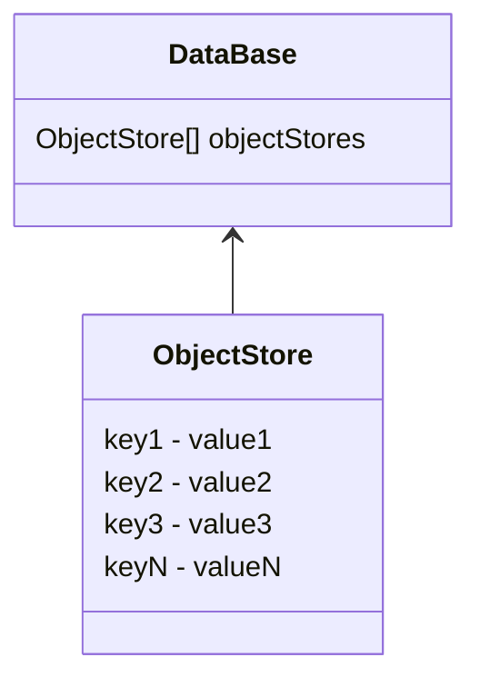

# IndexedDB

## 概述

IndexedDB（下面简称 index）是浏览器端（前端）的非关系（构建在索引表的基础上）DBMS，一种专门针对 JavaScript 优化的 NoSQL，能存储大多数的大量的结构化的 JavaScript 值，包括 Blob 和 ArrayBuffer ，且具备事务一致性。

简单地说：

- index is the localStorage on steroids or an enlarged version of localStorage.
- index is a simple key-value DB with transaction, but powerful enough to support PWA, and easy to use.

参考文献：

- [W3C 的标准规范](https://www.w3.org/TR/IndexedDB/)
- [MDN 的标准指南](https://developer.mozilla.org/en-US/docs/Web/API/IndexedDB_API)
- [index 采取的存储对象的方法](https://developer.mozilla.org/en-US/docs/Web/API/Web_Workers_API/Structured_clone_algorithm)
- [index 标准教程](https://javascript.info/indexeddb)

支持的值：

1. 基本类型除了 symbol 其他都支持
2. 普通对象（非相互循环的） - 只保存它自己（非枚举和继承的都不保存）的键值对
3. 数组支持
4. 函数不支持
5. 正则表达式支持 - 只保存正则表达式的核心信息
6. 日期对象支持 - 只保存日期对象的核心信息

有一些已经封装了 index apis 的工具：

- https://github.com/localForage/localForage
- https://github.com/pouchdb/pouchdb
- https://github.com/dexie/Dexie.js
- https://github.com/jakearchibald/idb
- https://github.com/jakearchibald/idb-keyval
- https://github.com/ujjwalguptaofficial/JsStore

### 其他大量内容存储方法：WebSQL（非标准，不再发展，仅 Chrome 还保留着）

WebSQL 也是在客户端存储大量内容的方式，只不过延续着 SQL 的语法，它仅被 WebKit 系的浏览器实现过，且从未列入到 W3C 标准里。它的移除主要是：JavaScript 更适合变长的值（比如 JSON），同时浏览器端不需要一个很复杂的 DBMS，一个简单但足够的即可。

WebSQL 构建在 SQLite 的基础上，SQLite 是一款轻量级的可移植的 RDBMS，由 C 语言写的，在嵌入式设备里占主导地位。

## 实践

### 演示 demo

参见 [此目录下的 index.html](./index.html) 的例子。

### 简单粗暴但高效的最佳实践

仅保存一个对象，同一时间仅存在一对键值对，键名是当前值内容的 version（比如 20230219.1），值是一个 JSON 串或任意结构的对象（或数组），如果更新导致值结构发生变化，将直接插入一条当前 version 值（比如 20230219.2）的记录，同时将旧内容做迁移，再将旧记录清空。

## Version Controlled

index 具备内建的 version 控制系统（SQLite 也存在），这在传统的 DBMS 是不存在的。index 保存在客户端，我们不能实时访问它，当客户在下次访问我们的软件时，可能需要更新它。

如果本地 DB 的 version 低于 open 指定的 version，将触发特殊的 onupgradeneeded 事件，同时创建一个特殊的 versionchange 事务，在此事务下，我们可以更新此 DB 的结构和内容，我们也只能在此事务下修改 DB 的结构。

当此 DB 不存在，其 version 默认是 0，而 open 方法的 version 参数默认是 1，最小值也是 1。

如果 open 一个较旧的 DB version，将触发 openReq.onerror。告知他们需要强制重载页面。

DB 的 version 是一个非 0 的自然数。

## 对象仓 - object store

在 DBMS 里叫做“表”（比如 MySQL）或“集合”（比如 MongoDB）。一个 db 可以存在多个对象仓。

仓的每个值都需要一个唯一的主键（数字、字符串、Date、ArrayBuffer、等）。



| keyPath | autoIncrement | the created object store                                                         |
| ------- | ------------- | -------------------------------------------------------------------------------- |
| N       | N             | 此仓可以存储任意类型的值（对象和基本类型），新增的值必须提供单独的主键           |
| Y       | N             | 此仓只能存储对象，且对象必须存在与 keyPath 同名的 property                       |
| N       | Y             | 此仓可以存储任意类型的值，每条记录的主键将自动生成，或者也可以提供一个单独的主键 |
| Y       | Y             | 此仓只能存储对象（前两者综合）                                                   |

## 事务

事务：一系列事情要么都成功要么都失败（回滚）

index 的全部与 DB 相关的操作都要在一个事务里执行。

index 的事务是自提交的（不需要自己提交），index 的制定者认为 index 的事务始终都是短时间的。

自提交时机：当此事务的全部请求的处理器（存在的）已经处理，且当前的 microtask 队列空时

事务类型：（标记不同的性能）

1. readonly：只能读取，多个 readonly 事务可以访问相同的对象仓
2. readwrite：只能读写（不能修改对象仓的结构），一个 readwrite 将独占一个对象仓（写锁），其他的 readwrite 请求将被挂起等待
3. versionchange：可以做任何操作，但是此事务只存在在 onupgradeneeded 事件里

事务事件：

1. oncomplete：一个事务圆满成功
2. onabort：事务被中止
3. onerror：有失败的请求冒泡到了此事务

## 索引（建立在对象仓的基础上的搜索视图）

索引是一个对象仓的特殊搜索视图（本体还是该对象仓），它按照特定的表达式来搜索记录，在 index 里，可按照对象的其他 keyPath 来创建一个索引。

因此 key 在不同语义下有不同含义：

- 在正常的对象仓下，key 就是 primaryKey
- 在索引的对象仓下，key 表示此索引指定的 keyPath 的值

```js
const ta = currentDB.transaction('books')
const os = ta.objectStore('books')
const priceIndex = os.index('priceIndex') // = booksStoreObject.createIndex('priceIndex', 'price')
// 假设 books 存在如下内容
// [
//   {
//     id: '01',
//     name: 'AA',
//     price: 22,
//   },
//   {
//     id: '02',
//     name: 'BB',
//     price: 22,
//   },
//   {
//     id: '03',
//     name: 'CC',
//     price: 24,
//   },
// ]
priceIndex.openCursor().onsuccess = (e) => {
  const cursor = e.target.result
  const primaryKey = cursor.primaryKey // primaryKey in original object store
  const key = cursor.key // keyPath in index object store
  const value = cursor.value // the value
  console.log('find', primaryKey, key, value)
}
// 上面的 log 将输出（可采取 openCursor(undefined, 'nextunique') 来去重相同的 key 值）
// find 01 22 { id, name, price }
// find 02 22 { id, name, price }
// find 03 24 { id, name, price }
```

## 搜索

### 搜索范围

采取 IDBKeyRange 创建搜索范围：

- `IDBKeyRange.lowerBound(lower, isOpen = false)`: search in `>= lower` or `> lower` if isOpen true
- `IDBKeyRange.upperBound(upper, isOpen = false)`: search in `<= upper` or `< upper` if isOpen true
- `IDBKeyRange.bound(lower, upper, isLowerOpen = false, isUpperOpen = false)`: search in a closed range
- `IDBKeyRange.only(key)`: search the specified key, useless

### 执行搜索

对象仓内的键值对都是已经按次的，因此得到的结果也是按次的。

下面的 query 是一个指定的 key 或一个 range 对象：

- `store.get(query)`: search the first matched value
- `store.getAll(query?, count = Infinite)`: search the all matched values with limit of count
- `store.getKey(query)`: search the first matched key
- `store.getAllKeys(query?, count = Infinite)`: search the all matched keys with limit of count
- `store.count(query)`: search the all matched keys and return the count

## 错误处理

冒泡：operations request event -> transaction -> db

监视`db.onerror`，从而代理全部的错误，就像`window.onerror`一样。

细节：

1. `e.preventDefault()` -> does not abort the transaction, and triggers the onerror on it but ignores the onabort
2. `e.stopPropagation()` -> aborts the transaction, and triggers the onabort on it but ignores the onerror
3. `e.preventDefault()` and `stopPropagation()` -> does not abort the transaction, ignores both the onerror and onabort

## 游标

一条一条地读取记录，从而避免一下子读取大量内容造成内存消耗过载。

- `const req = store.openCursor(query?, direction = 'next')` - similar to getAll but with a cursor
- `const req = store.openKeyCursor(query?, direction = 'next')` - similar to getAllKeys but with a cursor

其中 direction：

- `next`: default, begin from the min index
- `prev`: begin from the max index
- `nextunique`: similar to next but skip the same key
- `prevunique`: similar to prev but skip the same key

游标的 req 的 onsuccess 每次都会触发。

```js
// cursorReq is an openCursor request
cursorReq.onsuccess = (e) => {
  const cursor = e.target.result // if no more records, cursor is null
  if (cursor) {
    const primaryKey = cursor.primaryKey // the record's primarKey
    const key = cursor.key // it is same with primarKey when open cursor on a normal object store and is index's keyPath value when open on index object store
    const value = cursor.value
    console.log('find', primaryKey, key, value)
    cursor.continue()
  } else {
    console.log('No more records.')
  }
}
// cursorReq is an openKeyCursor request
cursorReq.onsuccess = (e) => {
  const cursor = e.target.result // if no more records, cursor is null
  if (cursor) {
    const primaryKey = cursor.primaryKey
    const key = cursor.key
    const value = cursor.value // always undefined in this mode
    console.log('find', primaryKey, key, value)
    cursor.continue()
  } else {
    console.log('No more records.')
  }
}
```

## The coexistence of new and old versions

关键词：onblocked 和 onversionchange

情景复现：

小红在 8 o'clock 访问了我们的页面（安装了 index 的 version 1），而我们在 9 o'clock 进行了更新，小红又在 10 o'clock 再次访问了我们的页面（此时代码将尝试安装 index 的 version 2），而一个网站的同一个 db 只能同时存在同一个 version，此时将出现：

1. new tab 标签页的 open 请求将触发 onblocked 事件，表示此 open 请求因为目前还存在其他活跃的旧的 version 而被暂停
2. old tab 标签页的对应的 db 将收到 onversionchange 事件，表示有一个新的 version 的 open 请求

可以同时处理这两个事件，不过，只处理 onblocked 事件是最简单且高效的，在此事件里告知访问者无法载入更新，直到他们关闭浏览器其他全部的 tab 页。

## api 列表

### IDBTransaction

IDBTransaction <- EventTarget <- Object

Instance properties：

1. `db: IDBDatabase`：关联的 db
2. `objectStoreNames: string[]`：关联的全部对象仓
3. `mode: 'readonly' | 'readwrite' | 'versionchange'`：模式
4. `error: Error`：错误消息
5. `durability: boolean`：是否是系统级的持久性存储而非临时（浏览器的缓存目录），在创建时由对应的 option 指定

Methods:

1. `objectStore(name: string)`：得到指定的对象仓
2. `abort()`：中止，同时回滚对此 db 的全部修改
3. `commit()`：立刻提交（非必要的）

Events:

1. `oncomplete`：正常结束
2. `onabort`：中止
3. `onerror`：发生错误

### IDBObjectStore

IDBObjectStore <- Object

Instance properties:

1. `keyPath: string`：键路径
2. `autoIncrement: boolean`：是否存在自增键
3. `indexNames: string[]`：全部索引
4. `name: string`：名称标识
5. `transaction: IDBTransaction`：工作在它上的 transaction

Instance methods:

1. `add(value, primaryKey?): IDBRequest`：插入（存在相同的主键将报错）
2. `put(value, primaryKey?): IDBRequest`：插入（存在相同的主键将覆盖）
3. `delete(query: primaryKey | IDBKeyRange): IDBRequest`：销毁
4. `clear(): IDBRequest`：清空
5. `get(query: primaryKey): IDBRequest`：检索
6. `getAll(query?: IDBKeyRange, count?: number): IDBRequest`：检索
7. `count(query?: IDBKeyRange): IDBRequest`：符合条件的记录的个数
8. `createIndex(indexName, keyPath, options?): IDBIdex`：创建一个索引
9. `index(indexName): IDBIdex`：得到指定的索引
10. `deleteIndex(indexName): void`：销毁一个索引
11. `getKey()`：检索键
12. `getAllKeys()`：检索键
13. `openCursor(): IDBRequest`：值游标
14. `openKeyCursor(): IDBRequest`：键游标

### IDBDatabase

IDBDatabase <- EventTarget

Instance properties:

1. `name: string`：名称标识
2. `objectStoreNames: string[]`：全部的对象仓
3. `version: uint64`：version 号

Instance methods:

1. `createObjectStore(name, options?): IDBObjectStore`：create an object store
2. `transaction(objectStoreName, mode, options?)`：open a transaction on an object store
3. `deleteObjectStore(name): void`：销毁一个对象仓
4. `close(): void`：关闭 closes all connections of the db

Events:

1. `onclose`
2. `onversionchange`
3. `onerror`

### IDBCursor

IDBCursor <- Object

Instance properties:

1. direction
2. key
3. primaryKey
4. request：the IDBRequest obtained the cursor
5. source：the IDBObjectStore or IDBIndex that the cursor iterating

Instance methods:

1. advance(count)：set some times a cursor should move its position forward
2. continue(key)
3. continuePrimaryKey(key, primaryKey)
4. delete()
5. update(newValue)

### IDBCursorWithValue

IDBCursorWithValue <- IDBCursor <- Object

Instance properties:

1. value：the current value

### IDBKeyRange

Instance properties:

1. lower
2. lowerOpen
3. upper
4. upperOpen

static methods:

1. bound
2. lowerBound
3. only
4. upperBound

Instance methods:

1. includes

### IDBIndex

Instance properties:

1. keyPath
2. multiEntry
3. name
4. objectStore
5. unique

Instance methods:

1. count
2. get
3. getAll
4. getKey
5. getAllKeys
6. openCursor
7. openKeyCursor

### IDBRequest

IDBRequest <- EventTarget

Instance properties:

1. error
2. readyState
3. result
4. source
5. transaction

Events:

1. onerror
2. onsuccess

### IDBOpenDBRequest

IDBOpenDBRequest <- IDBRequest <- EventTarget

Events:

1. onblocked
2. onupgradeneeded

### IDBVersionChangeEvent

IDBVersionChangeEvent <- Event

Instance properties:

1. oldVersion
2. newVersion

### IDBFactory

IDBFactory is the Constructor of the `window.indexedDB`.

Prototype methods:

1. cmp
2. databases
3. deleteDatabase
4. open
5. transaction
