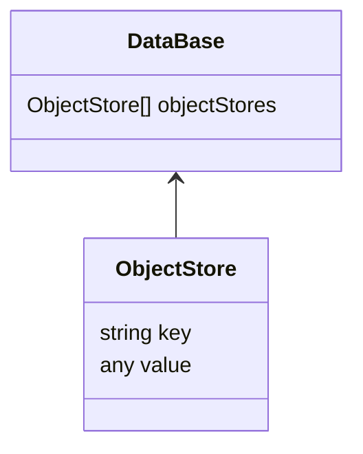

IndexedDB（下面简称 index）是浏览器端（前端）的非关系（使用索引表）DBMS，一种专门针对 JavaScript 优化的 NoSQL，能存储大量的 JavaScript 数据结构（经过结构化处理），甚至包括二进制数据（Blob 或 ArrayBuffer 对象），且具备事务一致性。

简单地说：

- index is the localStorage on steroids or an enlarged version of localStorage.
- index is a simple key-value db, but powerful enough to support PWA, and easy to use.

参考文献：

1. W3C 的标准规范：https://www.w3.org/TR/IndexedDB/
2. MDN 的标准指南：https://developer.mozilla.org/en-US/docs/Web/API/IndexedDB_API
3. index 使用的存储对象的方法：https://developer.mozilla.org/en-US/docs/Web/API/Web_Workers_API/Structured_clone_algorithm
4. index 标准教程：https://javascript.info/indexeddb

数据结构支持情况：

1. 不支持的基本类型：symbol
2. 普通对象（非循环引用） - 只保存它自己（非枚举和继承的都不保存）的键值对
3. 数组支持
4. 函数不支持
5. 正则表达式支持 - 只保存正则表达式的核心信息
6. 日期对象支持 - 只保存日期对象的核心信息

浏览器在隐私模式下不能使用 index，可能 open 失败（取决于浏览器的实现），也可能可以 open 但是一旦退出就会清除数据。

index 受限同源策略。

index 只是底层 api，有一些已经封装了这些内在细节的工具：

- https://github.com/localForage/localForage
- https://github.com/pouchdb/pouchdb
- https://github.com/dexie/Dexie.js
- https://github.com/jakearchibald/idb
- https://github.com/jakearchibald/idb-keyval
- https://github.com/ujjwalguptaofficial/JsStore

## 版本控制

index 具备内建的版本控制系统，这在传统的 DBMS 是不存在的，因为 index 保存在客户端，软件编写者不能实时访问它，因此，当发布新版本的软件时，使用者再次访问我们的软件，可能需要更新它。

如果本地 DBVersion 低于 open 指定的 version，将触发特殊的 upgradeneeded 事件，同时创建一个特殊的 versionchange 事务，在此事务下，我们可以更新此 db 的结构和数据（权限最高的事务），我们也只能在此事务下修改 db 的结构。

当此 db 还不存在时，其 version 默认是 0，而 open 方法不指定第二个 version 参数，默认是 1。

如果 open 一个较旧的 db version，将触发 openReq.onerror，例如使用者之前载入过新的代码（使得本地的 db version 是新的）但是由于一些特殊情况又载入了旧的代码（比如 CDN 缓存的问题）。此时我们可以查看 db 的 version 同时告知使用者强制重载页面。

## 对象仓 - object store

在其他 DBMS 里叫做“表”或“集合”。一个 db 可以存在多个对象仓。

仓的每个值都需要一个唯一的主键（数字、字符串、等）。



## 事务

事务：一系列事情要么都成功要么都失败（回滚）

index 的全部与 db 相关的操作都要在一个事务里执行。

index 的事务是自提交的（不需要也不能手动提交），index 的制定者认为 index 的事务应该是短时间的，为了浏览器的性能考虑。

自提交时机：当此事务的全部请求的处理器（存在的）已经处理，且当前的 microtask 队列空时

index 也有手动提交的方法 commit（正常情况，不需要使用此方法），执行 commit，将不再等待还没返回的请求。

监视事务的 oncomplete 事件，只有此事件触发，才能表示一个事务完整地执行了。

事务类型：（标记不同的性能）

1. readonly：只能读取，多个 readonly 事务可以访问相同的对象仓
2. readwrite：只能读写（不能修改对象仓），一个 readwrite 将独占一个对象仓（写锁），其他的 readwrite 请求将被挂起等待
3. versionChange：可以做任何操作，但是此事务不能被手动创建，只存在于 onupgradeneeded 事件里

## 搜索

### 搜索范围

使用 IDBKeyRange 创造搜索范围：

- `IDBKeyRange.lowerBound(lower, isOpen = false)`: search in `>= lower` or `> lower` if isOpen true
- `IDBKeyRange.upperBound(upper, isOpen = false)`: search in `<= upper` or `< upper` if isOpen true
- `IDBKeyRange.bound(lower, upper, isLowerOpen = false, isUpperOpen = false)`: search in `[lower, upper]` or `(lower, upper)` if isOpen both true
- `IDBKeyRange.only(key)`: search the specified key

### 执行搜索

对象仓内的建都是已经 ordered 的，返回的结构也是 ordered 的。

下面的 query 是一个指定的 key 或一个 range 对象。

- `store.get(query)`: search the first matched value
- `store.getAll(query?, count = Infinite)`: search the all matched values with limit of count
- `store.getKey(query)`: search the first matched key
- `store.getAllKeys(query?, count = Infinite)`: search the all matched keys with limit of count
- `store.count(query)`: search the all matched keys and return its count

## 错误处理

index 的事件冒泡：operations request -> transaction -> db

我们可以监视`db.onerror`，从而代理全部的错误，就像`window.onerror`一样。

有些时候，我们的操作可能失败，比如`store.add`操作，失败的 error event 将默认中止它的事务，我们可以在此 onerror 事件处理器里执行`event.preventDefault()`来阻止默认的中止行为，从而避免中止整个事务，还可以执行`event.stopPropagation()`来阻止冒泡到它的 db。

## 游标

一条一条地读取记录，从而避免一下子读取大量数据造成内存消耗。

- `const req = store.openCursor(query, direction = 'next')` - similar to getAll but with a cursor
- `const req = store.openKeyCursor(query, direction = 'next')` - similar to getAllKeys but with a cursor

其中 direction：

- `next`: default, begin from the min index
- `prev`: begin from the max index
- `nextUniqe`: similar to next but skip the same key
- `prevUniqe`: similar to prev but skip the same key

游标的 req 的 onsuccess 每次都会触发。

```js
// cursorReq is a openCursor
cursorReq.onsuccess = (e) => {
  const res = e.target.result // if no more records, res is null
  if (res) {
    const key = res.key
    const value = res.value
    console.log('find', key, value)
    res.continue()
  } else {
    console.log('No more records.')
  }
}
// cursorReq is a openKeyCursor
cursorReq.onsuccess = (e) => {
  const res = e.target.result // if no more records, res is null
  if (res) {
    const primaryKey = cursor.primaryKey // the record's primary key
    // cursor.key === cursor.value
    const key = cursor.key // the key
    const value = cursor.value // the key
    console.log('find', primaryKey, key, value)
    res.continue()
  } else {
    console.log('No more records.')
  }
}
```

## 索引

根据对象的 keypath 来创建新的搜索方式（按特定的 keypath 搜索）。

## 新旧版本同时存在的情况

关键词：onblocked 和 onversionchange

情景复现：

小红在 8 o'clock 访问了我们的页面（安装了 index 的 version 1），而我们在 9 o'clock 进行了更新，小红又在 10 o'clock 使用新的标签页再次访问了我们的页面（此时代码将尝试安装 index 的 version 2），而一个 sameorigin 的网站只能同时存在相同 version 的 db，不能同时存在多个不同的 version，将出现：

- 新 tab 标签页的 open 请求将触发 onblocked 事件，表示此 open 请求由于目前还存在其他活跃旧的 version 而被暂停
- 旧 tab 标签页的对应的 db 将收到 onversionchange 事件，表示有一个新 version 的 open 请求

可以同时处理这两个事件，不过，只处理 onblocked 事件是最简单且高效的，在此事件里告知访问者无法加载更新，直到他们关闭浏览器其他全部的 tab 页。

## api 列表

### IDBTransaction

IDBTransaction <- EventTarget <- Object

Instance properties：

1. db: readonly, return the db that the transaction operating
2. error: readonly, return any error message
3. mode: readonly, return the transaction type(readonly, readwrite and versionchange)
4. objectStoreNames: readonly, the all object stores that the transaction operating

Methods:

1. abort(): abort current transaction and roll back all opertions
2. commit(): commit current transaction immediately
3. objectStore(name): get an object store to operate it within the transaction scope

Events:

1. onabort
2. oncomplete
3. onerror

### IDBObjectStore

### IDBDatabase

### IDBCursor

### IDBCursorWithValue

### IDBKeyRange

### IDBIndex

### IDBFactory

### IDBRequest

### IDBOpenDBRequest

### IDBVersionChangeEvent
