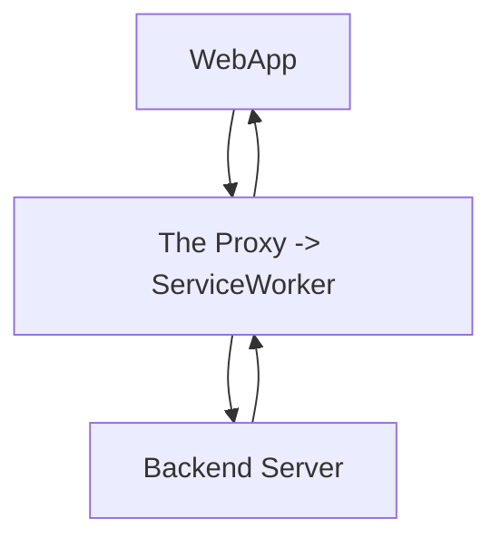

# ServiceWorker

地址：<https://developer.mozilla.org/en-US/docs/Web/API/Service_Worker_API>

## 概述

离线缓存的终极方案，代理一个网站的**全部**请求，从而细颗粒度地控制需要被缓存的资源。

ServiceWorker 的 [Cache API](./Cache.md) 能完整地缓存一次网络请求的 request(key) 和 response(value) 对象。

## 注意！

SW 是一个强大但又危险的功能，在千奇百怪的客户端环境下，难免出现 SW 缓存导致的各种问题，一旦出现这种问题，往往是严重线上事故，因为客户端的远端更新将由于错误的缓存而失效。因此，SW 需要 version 检测机制（清除一些缓存）。

最佳实践：（ServiceWorker 的控制度依次降低）

1. 始终不要缓存入口文件
2. 在本地，需要时常检测 version，从而失活一些缓存
3. SW 不要缓存软件本身，而是缓存一个类似`404.fallback.html`的页面，就好似 Edge 浏览器在离线下可以玩【冲浪游戏】一样
4. 非必要，不使用 SW（SW 只是一个锦上添花的技术）

## 一个简单的 demo

此 demo 结合了 indexedDB.

参见[index.html](./demo/index.html)。
