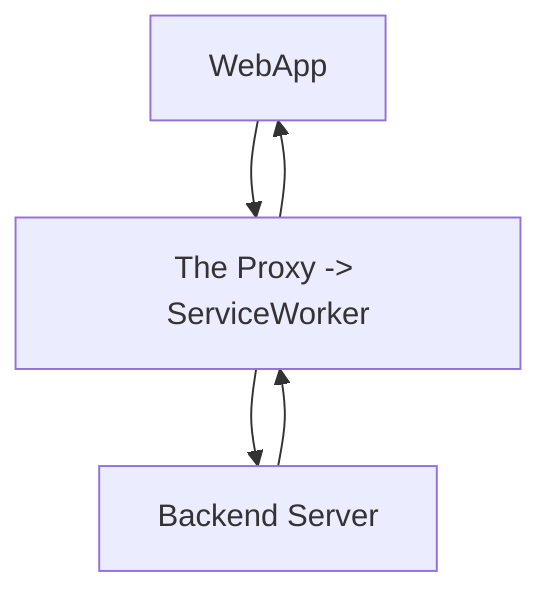

# ServiceWorker

## 概述

离线缓存的终极方案，代理一个网站的**全部**请求，从而细颗粒度地控制需要被缓存的资源。

ServiceWorker 的 [Cache API](#cache-api) 能完整地缓存一次网络请求的 request(key) 和 response(value) 对象。

## Cache API

与 indexedDB 相比，Cache 能记录下 request 与 response 的全部内容！

相同 request 的 URL 但是 headers 不同（其他的也同理），可以保存多条与它相应的 response 的记录。

与 window.indexedDB 对象一样（IDBFactory 接口的浏览器内置实现），window.caches 对象是 CacheStorage 接口的一个浏览器内置实现。

### CacheStorage 方法

1. `open(cacheName: string): Promise<Cache>` 创建（不存在）或得到（已存在）一个 Cache 对象
2. `delete(cacheName: string): Promise<boolean>` 移除一个 Cache 对象
3. `has(cacheName: string): Promise<boolean>` 检测一个 Cache 对象的存在性
4. `keys(): Promise<string[]>` 得到全部的 Cache 对象的名称
5. `match(req: URLString | Request): Promise<Response | undefined>` 在全部的 Cache 对象里查找符合 request 的记录，这样我们就不必一个一个地 open 全部的 Cache 对象再 match 了

### Cache 方法

1. `add(req: URLString | Request): Promise<void>` 根据请求参数获取它的 response，缓存到 cache 里，即 fetch + cache.put
2. `addAll(req: Array<URLString | Request>): Promise<void>` add 的批量方式
3. `put(req: Request, res: Response): Promise<void>` 缓存给定的 request 和 response，仅支持 GET 请求，会覆盖相同 request 的记录
4. `delete(req: URLString | Request): Promise<boolean>` 移除给定 request 的记录
5. `match(req: URLString | Request): Promise<Response | undefined>` 查找
6. `matchAll(req: URLString | Request): Promise<Response[]>` match 的批量方式
7. `keys(): Promise<Request>` 得到全部的记录

备注：

1. 如果 add 得到的 response 的 status 非 200，将拒绝决议，而 put 可以放入非 200 的 response
2. delete 和 match 方法支持一个搜索配置项（见下面的文档）

文档：<https://developer.mozilla.org/en-US/docs/Web/API/Cache>

## 注意！

SW 是一个强大但又危险的功能，在千奇百怪的客户端环境下，难免出现 SW 缓存导致的各种问题，一旦出现这种问题，往往是严重线上事故，因为客户端的远端更新将由于错误的缓存而失效。因此，SW 需要 version 检测机制（清除一些缓存）。

最佳实践：（ServiceWorker 的控制度依次降低）

1. 始终不要缓存入口文件
2. 在本地，需要时常检测 version，从而失活一些缓存
3. SW 不要缓存软件本身，而是缓存一个类似`404.fallback.html`的页面，就好似 Edge 浏览器在离线下可以玩【冲浪游戏】一样
4. 非必要，不使用 SW（SW 只是一个锦上添花的技术）

## 一个简单的 demo

此 demo 结合了 indexedDB.

参见[index.html](./demo/index.html)。
