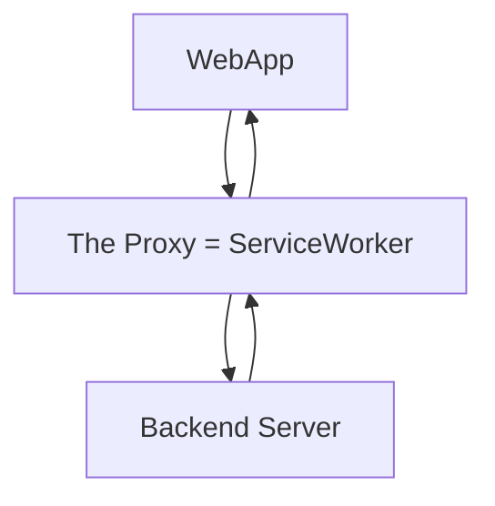

离线缓存的终极方案，代理一个网站的全部资源请求（XHR 或 fetch），从而可编程地细颗粒度地控制需要被缓存的资源。

ServiceWorker 能完整的缓存一次网络请求的 request 和 response 对象。

```mermaid
graph TD

app["WebApp"]
sw["The Proxy = ServiceWorker"]
server["Backend Server"]

app --> sw --> server --> sw --> app
```
