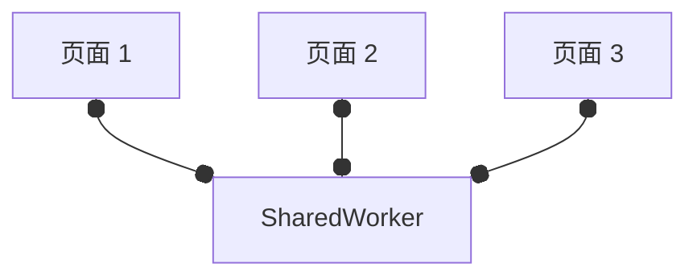

# SharedWorker

SharedWorker 是一个特定类型的 WebWorker，可在多个浏览器上下文间共享同一个 Worker，例如，多个 窗口、iframe、worker、等等。

这些上下文需要 same-origin。

## 前置知识：MessageChannel

参见[MessageChannel](../MessageChannel/index.md)。

## SharedWorker 的例子

Chrome 的 SharedWorker 的任何日志输出（包括错误）不会发送到主线程，需要`chrome://inspect/`找到`Shared Workers`一栏，找对你的 SharedWorker，点`inspect`按钮，可以 open 它的 debugger 面板。

Firefox 的 SharedWorker 都会发送到主线程。

图示：（黑点代表一个 MessagePort）

例子参见 [index.html](./demo/index.html)。
