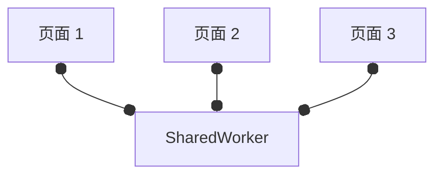

# SharedWorker

SharedWorker 是一个特定类型的 WebWorker，可在多个浏览器上下文间共享数据，例如，多个 窗口、iframe、DedicatedWorker、等等。

这些上下文需要 same-origin。

## 前置知识：MessageChannel

连接两个不同的上下文，比如：iframe 的、DWroker 的、等等。

比如，直接使用 MessageChannel 代理两个 DWorker 的消息发送，而不需要再走主线程中转了。

```js
// 主线程
const w1 = new Worker('./w1.js')
const w2 = new Worker('./w2.js')
const channel = new MessageChannel()

// channel 的每个 port 需要 start 使其激活（onmessage 的 setter 里会自执行一次，而 addEventListener 不会）

// 我们需要把这两个 port 转交给这两个 worker
// postMessage 的第二个参数支持一个 Transferable Objects 数组（以转移或转交一个数据而不是复制），而 channel 的 port1 和 port2 就是此类型
w1.postMessage({ type: 'connecting', port: channel.port1 }, [channel.port1])
w2.postMessage({ type: 'connecting', port: channel.port2 }, [channel.port2])
```

TransferableObject: <https://developer.mozilla.org/en-US/docs/Web/API/Web_Workers_API/Transferable_objects>

## SharedWorker 的例子

Chrome 的 SharedWorker 的任何日志输出（包括错误）不会发送到主线程，需要`chrome://inspect/`找到`Shared Workers`一栏，找对你的 SharedWorker，点`inspect`按钮，可以 open 它的 debugger 面板。

Firefox 的 SharedWorker 都会发送到主线程。

图示：（黑点代表一个 MessagePort）



例子参见 [index.html](./demo/index.html)。
