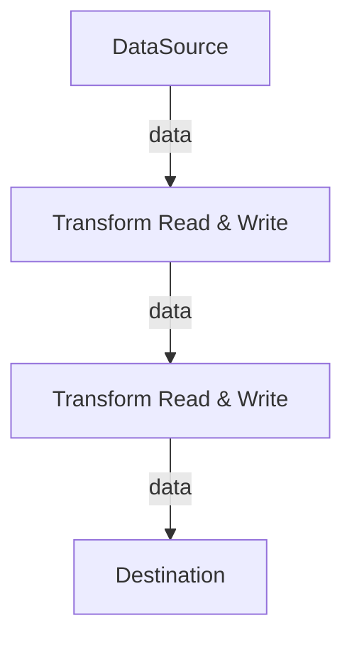

# The Stream Operations in WHATWG with JavaScript

文档地址：<https://developer.mozilla.org/en-US/docs/Web/API/Streams_API>

可读流(ReadableStream)：一个载有数据的池子，从这里读取值，同时有且只能一个 consumer 在读

可写流(WritableStream)：一个待被填充的池子，将值写入这里，同时有且只能一个 producer 在写

浏览器内置的 gzip-stream: <https://developer.mozilla.org/en-US/docs/Web/API/Compression_Streams_API>
