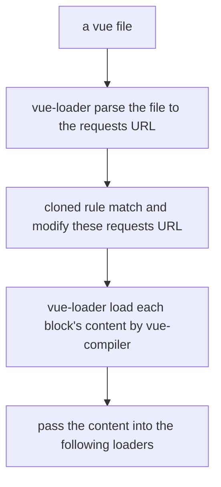

# `npx @vue/cli create <projectName>`

目前（2023 年）Vue 已经从 Webpack 迁移到 Vite。
Vite 的配置和插件编写比 Webpack 简单，且 ESBuild 的配置也比 Babel 简单。

## 目录结构

`/public/favicon.ico` 图标
`/public/index.html` carrying with webpack variables and will be injected the result bundle created by webpack
`/src/assets` 资源
`/src/components` 公共组件
`/src/views` 页面
`/src/App.vue` the root component
`/src/main.js` the entry
`/src/router.js` the vue-router config
`/src/store.js` the vuex config
`/src/.browserslistrc` 浏览器最低兼容配置文件
`/src/.eslintrc.js` eslint 配置文件，被`@vue/cli-plugin-eslint`读取，再 merge 处理，得到最终的 eslint 配置
`/src/.gitignore` git 忽略列表
`/src/babel.config.js` babel 配置文件，被`@vue/cli-plugin-babel`读取，再 merge 处理，得到最终的 babel 配置
`/src/tsconfig.js` TypeScript 项目的描述文件
`/src/jsconfig.js` JavaScript 项目的描述文件
`/src/vue.config.js` 自定义打包配置文件，vue-cli-service 读取此配置文件，以修改一些 webpack 的配置项
`/src/package-lock.json` 依赖锁
`/src/package.json` 项目描述文件
`/src/postcss.config.js` postcss 处理器的配置文件
`/src/README.md` 自述文件

## package.json

```json
{
  "name": "projectName",
  "version": "0.0.0",
  "private": true,
  "scripts": {
    "serve": "vue-cli-service serve", // run project
    "build": "vue-cli-service build", // build project
    "lint": "vue-cli-service lint" // check and auto-fix project
  },
  "dependencies": {
    "core-js": "^2.6.5", // polyfill
    "vue": "^2.6.10", // the vue framework
    "vue-router": "^3.0.3", // the router for vue
    "vuex": "^3.0.3" // the state manager for vue
  },
  "devDependencies": {
    "@vue/cli-plugin-babel": "^3.12.0", // a vue-cli-service plugin for handling babel config file and installing relatived dependencies
    "@vue/cli-plugin-eslint": "^3.12.0", // a vue-cli-service plugin for handling eslint config file and installing relatived dependencies
    "@vue/cli-service": "^3.12.0", // a service for run and build a vue project using webpack4
    "babel-eslint": "^10.0.1", // a eslint parser that transform the ast created by babel to a new ast that can be recognized by eslint when using experimental features unsupported in eslint itself, otherwise use default parser instead
    "eslint": "^5.16.0", // the eslint core
    "eslint-plugin-vue": "^5.0.0", // a eslint plugin for check the vue files, including a vue-eslint-parser, rules, plugins, and other configurations out of box
    "vue-template-compiler": "^2.6.10" // a compiler for compile the template block of vue file into a render function
  }
}
```

## How Vue-Loader Works

1. vue-loader-plugin will clone and modify all the rules defined in webpack so that each vue file block can reuse the existed rule

2. vue-loader(test `/^\.vue$/`) will parse vue file into the result as following

   ```js
   // code returned from the main loader for 'source.vue'

   // import the <template> block
   import [render, staticRenderFns] from 'source.vue?vue&type=template'

   // import the <script> block
   import script from 'source.vue?vue&type=script'

   // import <style> blocks
   // style block 1
   import 'source.vue?vue&type=style&index=1'
   // style block 2
   import 'source.vue?vue&type=style&index=2&scoped=1&lang=stylus'

   script.render = (render.staticRenderFns = staticRenderFns, render)
   export default script
   ```

3. above requests will be matched by vue-laoder's pitch, modify and fill the following loaders for each request

   ```js
   // 前置知识
   // import something from 'loaderA!/node_modules/loaderB/index.js?param=value!source.js'
   // 其中，loaderA是已经定义在匹配的rule里的loaderA

   // 如果template使用pug语法，将是vue-template-pug-loader
   // 由于template-loader得到的渲染函数不再由babel等处理，就导致老版本的vue2.x项目不能在template使用新语法（比如可选链）
   import [render, staticRenderFns] from "vue-template-loader!vue-loader!source.vue?vue&type=template"

   // ts-loader可以不使用，因为babel-loader也能自动剥离ts语法（但是不做任何ts语法检查）
   import script from "eslint-babel-loader!babel-loader!ts-loader!vue-loader!source.vue?vue&type=script&lang=ts"

   // 普通的css注入，不含scoped
   import "style-loader!css-loader!vue-loader!source.vue?vue&type=style&index=1"
   // stylus-loader与其他less-loader和sass-loader一样生成标准的cssom的ast，postcss-loader给每个选择器写上对应的hash值
   import "style-loader!css-loader!postcss-loader!stylus-loader!vue-loader!source.vue?vue&type=style&index=2&scoped=1&lang=stylus"
   ```

4. these requests will be matched first by vue-loader again, in this time, vue-loader will select a corresponding compiler for compiling a block

   ```js
   function select(loaderContext) {
     // loaderContext是webpack执行loader时提供的上下文对象
     const compiler = getCompiler(loaderContext) // 根据当前的上下文信息得到对应版本的vue-compiler
     const type = loaderContext.query.type
     switch (type) {
       case 'template':
         {
           // 得到template的ast
           const result = compiler.compileTemplate(loaderContext.resource)
           loaderContext.callback(
             // 交给下一个loader
             null, // no error
             result.content,
             result.map
           )
         }
         break
       case 'script':
         {
           // 简单做一些配置格式化，再返回script的内容
           const result = compiler.compileScript(loaderContext.resource)
           loaderContext.callback(null, result.content, result.map)
         }
         break
       case 'style':
         {
           // 直接返回style的内容
           const result = compiler.compileStyle(loaderContext.resource)
           loaderContext.callback(null, result.content, result.map, {
             scoped: 1, // loader的meta信息，将传递给下一个loader，webpack不处理它
           })
         }
         break
     }
   }
   ```

   vue-loader uses corresponding select compiler to return result and pass the result into the following loaders

图示：



## 项目的插件列表：

1.  VueLoaderPlugin 协助 vue-loader
1.  DefineVariablesPlugin 在 process.env 上定义一些变量
1.  FriendlyErrorPlugin
1.  HotReplacePlugin
1.  ProgressPlugin 打包进度条
1.  CreateIndexPlugin 创建 index.html 同时填入变量
1.  PreloadPlugin
1.  PrefetchPlugin
1.  CopyPlugin 复制资源

## the internal for `@vue/cli-plugin-*`

### `@vue/cli-plugin-babel`

the `@vue/cli-babel@3.12.1`'s package dependencies

```json
{
  "dependencies": {
    "@babel/core": "^7.0.0", // the core of transpiling code
    "@vue/babel-preset-app": "^3.12.1", // a babel preset for vue project
    "@vue/cli-shared-utils": "^3.12.1", // some common vue cli tools
    "babel-loader": "^8.0.5", // a webpack loader for transpiling code by using @babel/core
    "webpack": "^4.0.0"
  }
}
```

the `@vue/babel-preset-app@3.12.1`'s package dependencies(the `@vue/app` appear in babel.config.js is this)

```json
{
  "dependencies": {
    "@babel/helper-module-imports": "^7.0.0",
    "@babel/plugin-proposal-class-properties": "^7.0.0",
    "@babel/plugin-proposal-decorators": "^7.1.0",
    "@babel/plugin-syntax-dynamic-import": "^7.0.0",
    "@babel/plugin-syntax-jsx": "^7.0.0", // jsx to ast
    "@babel/plugin-transform-runtime": "^7.4.0",
    "@babel/preset-env": "^7.0.0 < 7.4.0", // the @babel/preset-env
    "@babel/runtime": "^7.0.0",
    "@babel/runtime-corejs2": "^7.2.0", // add corejs@2 for @babel/runtime
    "@vue/babel-preset-jsx": "^1.0.0", // babel preset for vue's jsx
    "babel-plugin-dynamic-import-node": "^2.2.0", // transpile `import()` to a deferred `require()` for node.js
    "babel-plugin-module-resolver": "3.2.0", // a path alias resolver, like `@` for `/src`
    "core-js": "^2.6.5"
  }
}
```

### `@vue/cli-plugin-eslint`

the `@vue/cli-plugin-eslint@3.12.1`'s package dependencies

```json
{
  "dependencies": {
    "@vue/cli-shared-utils": "^3.12.1",
    "babel-eslint": "^10.0.1",
    "eslint-loader": "^2.1.2", // a webpack loader for check and fix code by using eslint
    "globby": "^9.2.0", // a glob matching implement
    "webpack": "^4.0.0",
    "yorkie": "^2.0.0" // git hooks management forked from husky
  }
}
```

the `eslint-plugin-vue@5.2.3` package dependencies

```json
{
  "dependencies": {
    "vue-eslint-parser": "^5.0.0"
  },
  "peerDependencies": {
    "eslint": "^5.0.0"
  }
}
```

the files in package vue-eslint-parser

```js
// index.js
module.exports = {
  rules: [
    'array-bracket-spacing': require('./rules/array-bracket-spacing'), // and so on, omit others
  ]
  configs: { // some optional configuration collections, each configuration can includes rules, plugins, and so on
    base: require("./configs/base"),
    essential: require("./configs/essential"), // extend from base, and add some new rules
    recommended: require("./configs/recommended"), // extend from essential, and add some new rules
  },
  processors: { // like webpack's loader, tell eslint how to process files other than js files
    ".vue": require("./processor"), // a processor to process vue file in eslint
  },
};
```

```ts
// a eslint processor interface for processor
module.exports = {
  processors: {
    '.ext': {
      // parse non-js or js-like source code to js code
      preprocess: function (source: string, filename: string) {
        // return an array of strings to lint 数组里包含的是需要eslint校验的代码块
        // these returned code blocks will be checked and fixed by eslint parser configured
        return [{ content: string, name: string }]
      },
      // handle and format problems emitted by eslint from the result of preprocess
      postprocess: function (messages: Object[], filename: string) {
        return messages.map((i) => ({ ...i, message: string }))
      },
    },
  },
}
```

if want to use other eslint parser with vue-eslint-parser, the `.eslintrc.js` configuration should like as following

```diff
- "parser": "babel-eslint-parser",
+ "parser": "vue-eslint-parser",
  "parserOptions": {
+   "parser": [["babel-eslint-parser", /* options */ { target: 'es6' }]],
  }
```

```js
// ./configs/base
module.exports = {
  parser: require.resolve('vue-eslint-parser'),
  parserOptions: {
    ecmaVersion: 2018,
    sourceType: 'module',
    ecmaFeatures: {
      jsx: true,
    },
  },
  env: {
    browser: true,
    es6: true,
  },
  plugins: ['vue'],
  rules: {
    'vue/comment-directive': 'error',
    'vue/jsx-uses-vars': 'error',
  },
}
```

the `vue-eslint-parser@5.0.0`'s package dependencies

```json
{
  "dependencies": {
    "debug": "^4.1.0", // a debugging utils
    "eslint-scope": "^4.0.0", // ECMAScript scope analyzer
    "eslint-visitor-keys": "^1.0.0", // like @babel/traverse and @babel/types
    "espree": "^4.1.0", // the eslint default parser
    "esquery": "^1.0.1", // like XPath, using query like css selector to select a ast node
    "lodash": "^4.17.11"
  }
}
```

How `eslint-plugin-vue` works

It sets eslint's parser to vue-eslint-parser. The eslint-loader is the first webpack loader to execute because of `enforece = 'pre'`. All files it encounters are parsed by vue-eslint-parser. When vue-eslint-parser encounters vue files, it will be parsed to corresponding js scripts. When vue-eslint-parser encounters other files, it will be sent to other parser that can handle. Finally, any non-js files will be parsed into js scripts by parsers and sent to eslint for check and fix.

## something about babel

### integration

1. `@babel/cli` a cli tool for using babel
2. `@babel/polyfill` a polyfill for es5 target, but on deprecated status, use core-js instead
3. `@babel/plugin-transform-runtime` inject a helper
4. `@babel/register` register a hook for node's `require` function, then babel will parse any module required just in time
5. `@babel/standalone` a compiled babel parser for using directly in browser, when need compile code dynamically in runtime

### utils

1. `@babel/parser` parse the source code(treat as latest version of ECMAScript) into ast, supporting JSX, Flow and TypeScript
2. `@babel/core` all these utils in the package, all in one
3. `@babel/generator` generate code from a ast
4. `@babel/code-frame` mark a segment(aka frame) code, always use when display error informations on a segment code
5. `@babel/runtime` a library that contains all babel's helper functions(internal usage helpers and common helpers that just like a lodash and can be used for polyfill)
6. `@babel/template` a code template compiler
7. `@babel/traverse` traverse the ast and modify ast nodes when needed
8. `@babel/types` provide the constants and methods for checking and modifying ast nodes

### helpers

1. `@babel/helper-compilation-targets` a helper by passing the informations about target(browser, node.js, etc.) and its version for determining what plugins or preset to be used, always uses with `@babel/preset`
2. `@babel/helper-module-imports` a helper that uses the function way to import a module, like `helper.addNamed('path', 'bar', 'foo')` is equal to `import { foo as bar } from 'path'`

source code for example for how `@babel/runtime` with `@babel/plugin-transform-runtime` uses:

```js
console.log([1, 2, 3, 4].includes(2))
```

using tradition polyfill:

```js
import { extends } from '@babel/runtime'
// the next line is created by @babel/plugin-transform-runtime automatically
import { includes } from '@babel/runtime/core-js/stable/array/includes'
extends(window.Array.prototype, { includes }) // polluted the native object's prototype
```

using runtime polyfill:

```js
// the next line is created by @babel/plugin-transform-runtime automatically
import { includes as __includes } from '@babel/runtime/core-js/stable/array/includes'
console.log(__includes.call([1, 2, 3, 4], 2)) // DO NOT polluted the native object's prototype
```
