# 组件树构建流程

（旧版本的，新版本的参见`https://github.com/Vladimirirr/HowVueWorksSealeded`的《组件树的构造》章节。）

## 文字描述

1. 组件初始化，初始化传入的 componentOptions，如果存在`vm.$options.el`则执行`$mount`方法，否则初始化结束，`$mount`方法最终执行`mountComponent`方法进行组件的挂载，即得到组件对应的 dom（挂载在`vm.$el`）并将其插入到父组件相应的 dom 里
2. `mountComponent`方法初始化`updateComponent => vm.update(vm.render())`方法，随后执行`new Watcher(vm, updateComponent, noop, function before(){ !isFirstUpdate && callHook('beforeUpdate') })`，初始化组件的渲染 watcher
3. 渲染 watcher 执行`value = this.getter.call(vm, vm)`以计算它的初始值，其中`this.getter`是`updateComponent`方法
4. `vm.render()`返回此组件的 VNode 树，使用`createElement(tagName | componentOptions, data, children)`方法返回 VNode，对于普通元素，直接返回`new VNode(tagName, data, children)`，对于子组件将执行`createComponent`方法，执行`Vue.extend(componentOptions)`初始化子组件的 componentOptions 并返回对应的组件构造函数（同时缓存此子组件：在子组件的 componentOptions 上挂载自身的构造函数，当下次再`Vue.extends`此 componentOptions 时，由于缓存了构造函数，就直接返回此构造函数），最终返回安装了 snabbdom 钩子（init、prepatch、insert 和 destroy）和组件构造函数的`new VNode('vue-component-{componentCtorId}-{componentName}', data, children)`，意味着相同子组件得到的 VNode 的 tagName 相同
5. 接下来继续执行`updateComponent`的`vm.update(vm.render())`，进入了`update`方法
6. 在 update，执行`vm.$el = patch(vm.$el: HTMLElement | null, VNode)`（`vm.$el`来自于`vm.$options.el`），执行`createElm(VNode, insertedVNodeQueue)`方法，按照传入的 VNode 创建对应的 dom 并挂载在`VNode.elm`上，对于它的子节点将递归地执行`createChildren`来创建，最终得到此 VNode 对应的 dom，如果存在`vm.$el`就替换它，最终返回此 dom
7. 在 createElm，如果遇到普通 VNode，createElm 将其转成 dom，并挂载到`VNode.elm`，如果遇到组件 VNode，执行`createComponent`方法，执行`VNode.data.init`钩子，执行`createComponentInstanceForVnode(VNode, parentInstance)`方法，执行组件的构造函数`VNode.componentOptions.Ctor({ isComponent: true, parentInstance })`并返回组件实例，确定组件的父子关系引用，将此实例挂载到`VNode.componentInstance`，再手动执行此实例的`mount`方法，回到步骤`2`，将此组件的 $el 赋值给 VNode 的 elm，即`VNode.elm = VNode.componentInstance.$el`，最终将`VNode.elm`插入到 parentElm，结束`createElm`方法
8. 如此，自定义组件就被组合进了父组件
9. 如果数据发生了变化，渲染 watcher 将重新执行`vm.update(vm.render())`，得到最新的 VNode，并进入 update，执行`patch(oldVNode, newVNode)`，对全部的 VNode 节点执行 patchVNode
10. patchVNode 新旧 VNode 时，对于组件 VNode 执行它的 prepatch 钩子，将`oldVNode.componentInstance`赋值给了 newVNode（**从而维持着组件实例**），并执行`updateChildComponent`方法，将新 VNode 的 props、attrs、listeners 和 children 赋值给组件实例对应的值，如果值不同，自然而然就触发子组件的 update
11. 如此往复

## 流程图描述

```mermaid

%% for more detail for flowchart of mermaid in markdown, see: https://mermaid-js.github.io/mermaid/#/flowchart

flowchart TD
  subgraph "首次渲染"
    initInstance["组件初始化"]
    initInstance --> isRootComponent{"存在`vm.$options.el`？"}
    doMount["挂载组件"] --> initRenderWatcher["初始化渲染watcher"] --> updateComponentOnFirst["执行updateComponent方法"] --> doRenderAndGetVNodeTree["执行render方法得到组件的VNode树"]
    initInstanceReturn["返回组件实例"]
    returnVNode["返回VNode"]
    isRootComponent -->|是| doMount
    isRootComponent -->|否| initInstanceReturn
    doRenderAndGetVNodeTree --> doRenderAndGetVNodeTree_a1["遇到普通dom元素"] --> doRenderAndGetVNodeTree_a2["`new VNode(tagName, data, children)`"] --> returnVNode
    doRenderAndGetVNodeTree --> doRenderAndGetVNodeTree_b1["遇到子组件"] --> doRenderAndGetVNodeTree_b2["执行createComponent方法"] --> doRenderAndGetVNodeTree_b3["初始化子组件的options得到组件构造方法"] --> doRenderAndGetVNodeTree_b4["`new VNode('vue-component-{cid}-{name}', data, children)`"] --> doRenderAndGetVNodeTree_b5["对此VNode安装钩子和组件构造方法"] --> returnVNode
    returnVNode --> doUpdate["执行update方法"] --> doPatchOnFirst["patch(vm.$el, VNode)"] --> doCreateElm["执行createElm方法"] --> createRootDom[创建根dom元素] --> doCreateChildren["执行createChildren方法递归创建此VNode子节点对应的dom"]
    doCreateChildren --> doCreateChildren_a1["普通VNode"] --> doCreateChildren_a2["创建dom"] --> bindDomToVNodeAndReturn
    doCreateChildren --> doCreateChildren_b1["组件VNode"] --> doCreateChildren_b2["执行createComponent方法"] --> doCreateChildren_b3["执行VNode.data.init钩子"] --> doCreateChildren_b4["执行createComponentInstanceForVnode方法"] --> doCreateChildren_b5["执行VNode.componentCtor得到组件实例"] --> doMount --> getSubComponentElm["得到子组件的`vm.$el`"] --> insertDomToParent["将dom插入到父dom"] --> bindDomToVNodeAndReturn
    bindDomToVNodeAndReturn["将此dom挂载到VNode.elm"] --> compositionDone[父子组件的组合完成] --> initEnd["结束"]

    linkStyle 28,29 stroke:blue,stroke-width:4px
    style doCreateChildren_b5 stroke:blue,stroke-width:4px

  end
  subgraph "重新渲染"
    dependencesChanged["依赖改变"] --> renderWatcherInvoke["渲染watcher重新执行"] --> updateComponent["执行组件的updateComponent方法"] --> doPatch["patch(oldVNode, newVNode)"] --> doPatchVNode["对每个VNode执行patchVNode"] --> isHasPrepatchHook{"存在`VNode.data.hook.prepatch`？"}
    isHasPrepatchHook -->|是| doPrepatchHook
    isHasPrepatchHook -->|否| patchVNodeEnd["patchVNode结束"]
    doPrepatchHook["执行prepatch钩子"] --> updateComponentInstance["将oldVNode.componentInstance和componentCtor赋值给newVNode"] --> doUpdateChildrenComponent["执行doUpdateChildrenComponent更新子组件实例"] --> isComponentStateChanged{"子组件状态发生改变？"}
    isComponentStateChanged -->|是| updateSubComponentLater["安排此子组件的更新`queueWatcher(thisRenderWatcher)`"] --> patchVNodeEnd
    isComponentStateChanged -->|否| patchVNodeEnd

  end
```

