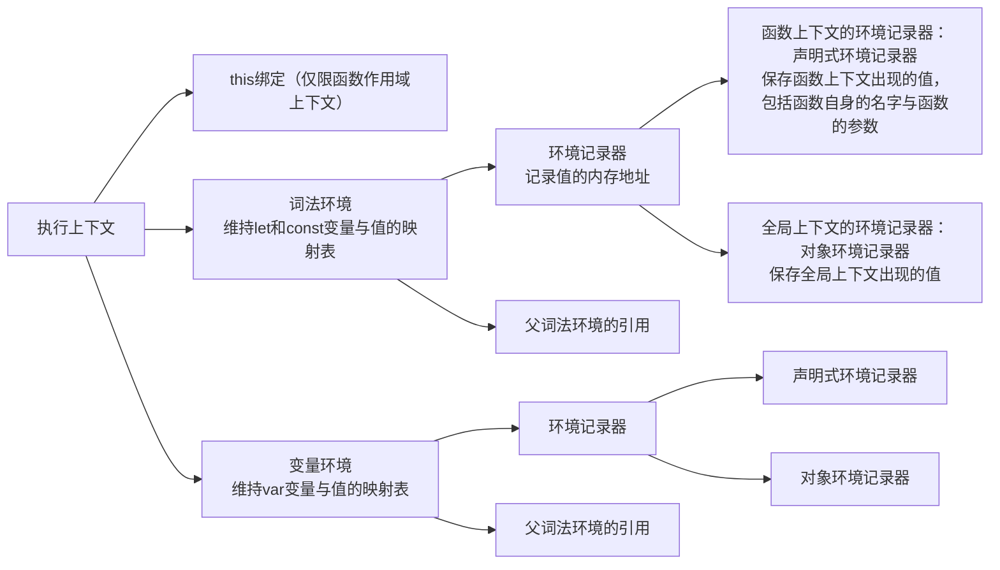

<h1 style="font-size: 1cm; color: #a71d5d; text-shadow: 0px 6px 4px #ffb8a3; text-align: center;">
《我的前端学习笔记》
</h1>

<h2>目录：</h2>
[TOC]

# 事件循环

The **EventLoop** model is essentially a **concurrency** model, which is **good at I/O-bound**.
A successful case is **Node.js** while its EventLoop model is a little difference with browser's.

一些注意点：

1. 如果在微任务执行期间又继续设定新的微任务，将导致页面卡顿，因为微任务执行期间必须要把当前的微任务队列执行清空而导致的
2. 如果在 RAF 任务执行期间又继续设定新的 RAF 任务，不会延迟页面渲染，新的 RAF 任务将在下一轮事件循环的 RAF 执行期间再执行

一个经典的题目：

```html
<div class="div1" id="div1">
  <div class="div2" id="div2"></div>
</div>
<script>
  div1.addEventListener('click', () => {
    queueMicrotask(() => console.log('micro in div1'))
    console.log('div1')
  })
  div2.addEventListener('click', () => {
    queueMicrotask(() => console.log('micro in div2'))
    console.log('div2')
  })
</script>
```

Question:

1. Use mouse click the div2, and answer the sequence of these logs
2. Use `div2.click` or `div2.dispatchEvent` method to simulate click on div2, and answer the sequence of these logs

Answer:

1. div2 -> micro in div2 -> div1 -> micro in div1
2. div2 -> div1 -> micro in div2 -> micro in div1

Why:

1. Click Event triggered by mouse meaning a user and truth event, which is a new real macrotask
2. Click Event triggered by any script meaning a non-user and truthless event, which is regarded as a **normal sync function call**

# 搭建私有 npm 仓库

基本工作方式：

1. 设置本机的 npm 源为内网地址：`npm config set registry http://172.31.0.10`
2. 搭建服务器，代理需要的 npm 请求（比如下载、上传）
3. 拦截下载请求，去内部的仓库数据库里查找是否存在此包，存在的话就返回
4. 不存在的话就就查询外网地址（比如 npm 的官方地址），下载和缓存此包再返回
5. 拦截上传请求，将包存放在内部数据库里

包的保存方式：

1. 文件系统：直接放在一个目录里
2. 数据库：保存二进制数据（对包压缩的结果）及其它们的索引信息，比如 MySQL 的各种 BLOB 类型变体
3. 其他存储方式：各种存储解决方案，比如 OSS

可用方案：

1. [verdaccio](https://github.com/verdaccio/verdaccio) 基于文件系统
2. [cnpmcore](https://github.com/cnpm/cnpmcore) 基于数据库的二进制保存方式
3. [nexus](https://www.sonatype.com/products/nexus-repository) 企业级的私有包管理仓库解决方案
4. [artifactory](https://jfrog.com/artifactory) 同上

# 路由与 URL

在 URL 上，你可以位于【一个文件】或【一个目录】，以`\`做区分，而在命令行模式下，你不能位于【一个文件】，永远只能位于【一个目录】，这是 URL 与命令行在路径处理上的最大区别，ReachRouter 使用命令行风格的路径在做路由导航，它忽视末尾的`\`，`\some\where\`被视作`\some\where`。

# axios 核心代码

```js
/**
 * 发送请求的核心axios方法，来自axios.0.19.2
 * @param {Object} config 请求的配置对象，与默认配置进行整合
 * @return {Promise} 返回一个promise对象表示此请求的结果
 */
Axios.prototype.request = function request(
  config = mergeConfig(this.defaults, config)
) {
  // 初始化请求的promise链
  // dispatchRequest在浏览器里就是XMLHttpRequest方法的封装
  // 如果一个promise的then的fulfillment处理器是undefined或null，表示将结果继续传递下去
  // 如果一个promise的then的rejection处理器是undefined或null，表示将错误继续抛出
  var chain = [dispatchRequest, undefined]

  // 初始化表示请求结果的promise
  var promise = Promise.resolve(config)

  // 将此请求的全部请求拦截器（在请求前的中间件）插入到chain前面
  this.interceptors.request.forEach(function unshiftRequestInterceptors(
    interceptor
  ) {
    chain.unshift(interceptor.fulfilled, interceptor.rejected)
  })

  // 将此请求的全部响应拦截器（在响应后的中间件）插入到chain后面
  this.interceptors.response.forEach(function pushResponseInterceptors(
    interceptor
  ) {
    chain.push(interceptor.fulfilled, interceptor.rejected)
  })

  // 激活整个promise链
  while (chain.length) {
    promise = promise.then(chain.shift(), chain.shift())
  }
  // 核心！promise链！
  // return (
  //  Promise.resolve(config)
  //  .then(requestInterceptor_2_fulfillment, requestInterceptor_2_rejection)
  //  .then(requestInterceptor_1_fulfillment, requestInterceptor_1_rejection)
  //  .then(dispatchRequest, undefined)
  //  .then(responseInterceptor_1_fulfillment, responseInterceptor_1_rejection)
  //  .then(responseInterceptor_2_fulfillment, responseInterceptor_2_rejection)
  // )
  // 返回表示请求结果的promise

  return promise
}
```

# React

## 指导思想

基本公式：`view = render(state)`

渲染函数 render 根据目前状态 state 得出的视图 view 是 VNode 树结构，它与平台无关，每次更新都会生成一颗最新的 VNode 树，再照着新树修改旧树，使得旧树与新树相同，此过程叫做 patch。而 patch 由各自的平台渲染器（Web 平台渲染器 ReactDOM，移动平台渲染器 ReactNative，服务端平台渲染器 ReactServer）实现。

**心智模型**：组件 = **副作用受限**于函数执行上下文的**纯函数**

React 组件的每次渲染都是一次全新的副作用受限的函数调用，函数的结果是代表此组件目前视图的 VNode 树。

由于纯函数不能有任何副作用（包括它内部也不能使用其他带有副作用的函数），而 React 组件函数内部的 useState hook 每次得到的结果都可能不一样（还包括其他内置 Hooks），这将污染组件函数，因此，React 提出代数效应来消除这些在组件函数里的副作用。

总结：React 的想法很简单，一个由各种组件构成的 APP 对应一颗 VNode 树，一旦其中的一个组件使用触发更新，将导致 React 重新生成一颗最新的 VNode 树，同时对比这两颗新旧 VNode 树，将变化反馈到真实的 view 中，而在运行时对比两颗复杂的新旧树相当消耗性能，因此 React 提出著名的 concurrent with fiber 架构。

假设有一门 React 语言，它的伪代码：

```jsx
import SubView from '/src/components/SubView' // 子组件
import SomeFeature from '/src/hooks/SomeFeature' // 可复用的公共逻辑块

// 一个特殊的函数（组件函数），使用关键字Component定义，与普通函数Function相区分
Component Foo(props) => {
  // useState in React
  const age: ComponentStateEffect = @context.state(props.age || 22) // 定义一个仅在Foo组件函数上下文的副作用，下同
  // the useMemo in React or the computed in Vue
  const doubleAge: ComponentMemorizedEffect = @context.memorized(() => age * 2, [age])
  // useEffect in React, the return value is useless, which is a wrapper that contains the function passed into `@context.effect`
  const userEffect: ComponentUserEffect = @context.effect(() => {
    // do something after component updated and doubleAge changed
  }, [doubleAge])
  // 导入公共逻辑
  const [featureA, featureB] = SomeFeature(/* some parameters if needed */)
  // 子组件
  const SubView = SubView(/* some parameters if needed */)
  // finally return the view a VNode Tree
  return <div class="Foo"><p>The age * 2 is {doubleAge}</p><SubView age={age}></SubView></div>
}

```

## Use concurrent to improve the performance of re-render

由于 React 一个组件的 state 变化，将导致它和它子组件全部重新渲染从而得到一颗最新的 VNode 树（单向数据流，从上而下传递），是 recursion 的渲染方式，需要消耗很多的内存和 CPU 资源。
To resolve the problem, the React Team determined to use concurrent mode replaced the traditional recursion mode, which means a high priority render task can interrupt a low priority render task, and the render system works on time slice mode.
And transform the Tree structure VNode to Linked-List structure [Fiber](https://github.com/acdlite/react-fiber-architecture).

## The concurrent apis in React 18

### `useTransition`钩子

Sign: `useTransition(): [isPending: Boolean, startTransition: Function]`

Description: It mark a update as a transition task(a low priority task), which can make UI still response during the expensive state transition.

### `useDeferredValue`钩子

Sign: `useDeferredValue(value: T): copiedValue: T`

Description: It receive a value and return its copy. Update to this value will be regarded as low priority. When an urgent task comes in, this hook will return the old value rendered last time to avoid triggering another unnecessary render during this urgent task. that is, delaying an unimportant render by returning a historical value when an urgent render comes in.

### `useSyncExternalStore`钩子

Sign: `useSyncExternalStore(store.subscribe: (listener) => Function, store.getSnapshot: () => T): T`

参数：

1. subscribe：让一个组件订阅一个状态
2. getSnapshot：获取订阅状态的当前快照，以便让 React 检查自上次渲染以来是否发生了变化，如果返回一个对象，请保证对象引用稳定，因为`{} !== {}`

向外部状态管理器提供的保证组件状态一致的接口。（由于 concurrent mode 导致的 break changing）

情景复现：一个渲染被打断成两段渲染，在第一段渲染的时候读取外部 A 值为 A1，期间由于高优先级渲染迫使打断当前的渲染，同时高优先级渲染还修改 A 值为 A2，继续第二段渲染渲染时又读取 A 值，最终，这次渲染得到的视图是撕裂的（同样都是渲染 A 值，一处是值 A1，另一处是值 A2）。

React 内部的状态都不存在撕裂问题，比如 useState、useContext。

举例：

```jsx
// 一个简单的外部状态管理器
const createStore = (init = []) => {
  const store = new Map(init)
  const listeners = new Set()
  const notify = () => listeners.forEach((i) => i())
  return {
    __store: store,
    __listeners: listeners,
    set(id, data) {
      store.set(id, data)
      notify()
    },
    del(id) {
      store.delete(id)
      notify()
    },
    subscribe(listener) {
      // React将传入一个listener，当状态被修改时要触发这些listeners从而告诉React需要重新获取最新的状态
      // listener = () => {
      //   if (checkIfSnapshotChanged()) { // 当一个listener被触发时，它将检测当前snapshot的值与上一次是否相同（使用`Object.is`）
      //     forceStoreRerender()
      //   }
      // }
      listeners.add(listener)
      return () => listeners.delete(listener)
    },
    getSnapshot() {
      return store // 始终返回闭包里的store，即引用稳定
    },
  }
}
const myStore = createStore([['foo', 12n]])

// 一个简单的封装
const useMyStore = (name) => {
  const value = useSyncExternalStore(
    myStore.subscribe,
    useCallback(() => myStore.getSnapshot().get(name), [name])
  )
  const updateValue = (newValue) => myStore.set(name, newValue) // myStore的set方法将触发全部的listeners，从而让React获取状态的最新值
  return [value, updateValue]
}
```

### `useInsertionEffect`钩子

sign: `useInsertionEffect(effect: Function): void`

在`useLayoutEffect`前，使得与样式相关的工具能正确地注入样式（比如注入`<style>`到`<head>`里），不能在此期间安排更新和使用 ref。

举例：

```jsx
const useClassName = (cssClassName) => {
  useInsertionEffect(() => {
    if (!isInserted.has(cssClassName)) {
      isInserted.add(cssClassName)
      document.head.appendChild(getStylesbyClassName(cssClassName))
    }
  })
  return cssClassName
}
const Foo = () => {
  const className = useClassName(cssClassName)
  return <div className={className}>Hi Foo</div>
}
```

### `React.lazy`方法

Sign: `React.lazy(() => import('dynamicComponent.jsx'))`

得到一个 React 内置的 Lazy 组件，Lazy 组件将在**整个 App 的组件树**里找到与它最近的 Suspense 组件，如果 Lazy 组件最终都没找到对应的 Suspense 组件，那么整个 App 将被延迟渲染直到 Lazy 组件可用。

### `React.Suspense`组件

指定其中的子组件树还没初始化完成时的加载器。

### React18 多个 UI 版本共存的情况

正在进行一个普通渲染，这时，一个高优先级渲染抢占普通渲染的渲染权，那么，React 就要维持两份 UI 版本（普通渲染和高优先级渲染各自对应的版本），需要注意的是，每份 UI 版本只有完全渲染结束 React 才会最终把它 commit 到视图，防止视图撕裂。

# Vue

## 指导思想

基本公式：`view = render(state)` same with React

**心智模型**：组件 = 使用**依赖跟踪**技术的**对象**

Vue2 的组件就是一个配置对象，Vue 内部使用`mergeOptions`方法让此配置对象继承根组件 Vue 的内置数据和功能，再使用`Vue.extend`方法将此组件从对象转成组件构造函数，最终使用`new`构造组件的实例。

Vue3 的组件依旧是一个配置对象，只不过被组合式语法隐藏，使用`setup`函数暴露出来的对象就是一个配置对象，简单地说，Vue3 就是使用 JavaScript 来描述配置对象，这就好比 grunt(Vue2) 与 gulp(Vue3)。

由于全部的依赖都是响应式的（或者说都是可被观察的），依赖本身可以自由地变化（即 mutable state，与 React 的 immutable state 相对），因此只需要初始化这些依赖一次，再将它们保存在某处（比如闭包里面(Vue3)或实例对象上(Vue2)），修改依赖就能触发对应的副作用（比如重新渲染）。

Vue2 把依赖及与依赖相关的行为和副作用（比如 computed、watch、lifecycle、renderFunction）都定义在组件的配置对象上，**基于对象**，复用手段只有不好驾驭的混入（混入是一个很经典的基于对象的复用技术，只不过很容易出错）。

Vue3 把依赖及与依赖相关的行为和副作用都定义在组件配置对象的 setup 函数里，**基于函数**，复用手段就相当灵活，任何函数复用的手段都能适用。

总结：组件的依赖收集组件的渲染函数，此时**依赖就是此渲染函数的订阅者**，而**渲染函数就是这些依赖的观察者**，当依赖发生了改变，将触发此依赖收集的渲染函数，使得组件发生更新。将依赖收集的东西扩展，依赖不仅可以收集渲染函数还能收集其他各种观察者，比如 computed 或 watch，依赖的观察者也叫做依赖的副作用，因为每次依赖改变时观察者都将被执行。

假设有一门 Vue 语言，它的伪代码：

```jsx
import SubView from '/src/components/SubView' // 子组件
import SomeFeature from '/src/hooks/SomeFeature' // 可复用的公共逻辑块

// 一个对象，表示Vue组件就是一个对象，而非React的函数，Vue3的setup函数只是让Vue组件看上去像函数一样而已
Component Foo(props) = { // props是对象的内置值
  name = 'nat' // 定义一个普通值，不参与组件的响应式系统
  track age = 22 // 定义一个依赖（关键字track），OOP里的数据
  computed doubleAge = this.age * 2 // 定义一个computed（关键字computed），依赖于age，也叫做age依赖的副作用
  watch age(){
    // 定义一个副作用函数（关键字watch），依赖于age，也叫做age依赖的副作用
    // do something
  }
  method addAge(){ // OOP里的方法
    return ++this.age // 访问和修改
  }
  lifecycle mounted(){
    // do something
  }
  component SubView // 引入一个组件（关键字component）
  import [track featureA, compouted featureB] = SomeFeature(/* pass props or not */) // 导入公共逻辑（关键字import），唯一能传入的参数就是props
  render(){
    // 组件的渲染函数，依赖于age，也叫做age依赖的副作用
    // 可以从template模板语法里编译而来
    return <b onClick={addAge}>{age}</b>
  }
}
```

## 响应式系统与依赖收集

Vue2 using `Object.defineProperty` function to transform all properties of a object into corresponding getter and setter in order to implement property interception to make reactive system.
Vue3 using `Proxy` function to intercept a object to make reactive system, the trap function get is the getter and set is the setter.

Because Vue2 has a bit of hack in its implementation, there are some edge problems that need special treatment:

1. Unable to respond to `set` and `delete` a key on an object in real time, so the alternates are `$set` and `$del` functions
2. The Array needs to hijack its prototype to realize responsiveness
3. The too complex object will cause too many getters and setters, resulting in serious memory consumption
4. Vue2 needs to fully make a data object reactive first(convert all its properties into corresponding getters and setters), while Vue3 is lazy, and just makes a dependency reactive only when it to be used
5. ...

需要让一个值在它变化时能响应一个行为，将此值转换成响应式，让此行为携带着此值去执行，当行为读取此值时，就触发此值的 getter，而 getter 将把此行为保存到对应的行为列表里，意味着此行为订阅了此值的变化，且当值变化时在它的 setter 中执行已经订阅的行为。

代码示例：

```ts
// Vue中的currentEffect保存在一个数组里，这是因为父子组件的存在，当执行子组件的依赖收集时，将子组件的渲染函数入栈，子组件结束就将子组件的渲染函数出栈，继续回到父组件，此时依旧还能找到父组件当前的渲染函数（即currentEffect）
// 此处简单处理，只做演示
let currentEffect: Function | null = null

/**
 * effect 副作用
 * data 响应式化的数据
 */
const autorun = (effect: Function, data: Object) => {
  currentEffect = effect
  effect(data)
  currentEffect = null
}

/**
 * data 需要被响应式化的对象
 */
const reactify = (data: Object) => {
  // 此处不考虑嵌套的对象以及数组，只做简单的演示，具体对嵌套对象以及数组的响应式化和它们的边缘情况处理，参见我写的Rue框架的响应式化的代码（有详细的注释）
  Object.keys(data).forEach((key) => {
    // 此匿名函数就充当了下面getter和setter的闭包存储区
    const dependencies = new Set() // 订阅此数据的全部订阅者，即effect
    let value = data[key] // 数据的值
    Object.defineProperty(data, key, {
      get: function () {
        if (currentEffect) {
          // 如果存在currentEffect，表示此值需要被一个effect依赖
          // Set集合能有效地避免收集相同的effect
          dependencies.add(currentEffect)
        }
        return value
      },
      set: function (newValue) {
        if (value !== newValue) {
          // 只有值改变才更新，比较算法不唯一，还可以使用`Object.is`方法
          value = newValue
          // 执行全部的effect
          dependencies.forEach((effect) => effect())
        }
        return value
      },
    })
  })
  return data
}

// 示例
// 数据对象
const userInfo: any = reactify({
  name: 'jack',
  age: '22',
})

// 此副作用很简单，向控制台输出当前的userInfo的信息
const userInfoChangeEffect = (userInfo) => {
  console.log(`Hello, I am ${userInfo.name} and ${userInfo.age} years old.`)
}

// 进行依赖收集
autorun(userInfoChangeEffect, userInfo)

// 验证数据对象变化是否能自动执行收集的副作用
userInfo.age++ // 控制台重新输出userInfo信息
```

## Template and JSX

Template 语法相比 JSX，它的灵活度低，但能进行静态优化（即 AOT(Ahead Of Time)，与 React 的 JIT(Just In Time) 相对），本质依旧是一个 render 函数。

### The static optimized on Template

#### Test Template

```html
<div>
  <div><span>hello Vue</span></div>
  <p>{{ message }}</p>
</div>
```

#### Vue2's optimization

当一个模板存在静态节点时，Vue2 codegen 将生成：

```js
function render() {
  with (this) {
    return _c('div', [
      // _c = createElement
      _m(0), // _m = renderStatic
      _c('p', [_v(_s(message))]), // _v = createTextVNode _s = toString
    ])
  }
}
function getStaticRender(index) {
  const staticRenders = [
    function () {
      with (this) {
        return _c('div', [_c('span', [_v('hello vue')])])
      }
    },
  ]
  return staticRenders[index]
}
function renderStatic(index) {
  if (!this.__renderStaticCache[index]) {
    this.__renderStaticCache[index] = getStaticRender(index).call(this)
    this.__renderStaticCache[index].isStatic = true // skip diffing the VNode and just reuse the VNode and its dom on update
  }
  return this.__renderStaticCache[index]
}
```

#### Vue3's optimization

A more stronger static optimization feature than Vue2:

1. Vue3's compiled render function carries more origin VNode structure informations than Vue2's that improves the performance of diff algorithm
2. static optimization is also available on a dynamic VNode, a template `<div foo="foo">{{ dynamic }}</div>` in Vue2 can not be optimized, but Vue3 optimizes the attribute foo as a static attribute and generates the render function like `createElement('div', { foo: 'foo' }, /* children */ [toDisplayString(dynamic)], /* static mark */ [attrs: ['foo']])`
3. ...

## `key`的作用

key 标识是否要复用当前的元素或组件。

当 key 附在 dom 元素上时，如果两次 diff 的 key 相同，就保留旧的 dom 元素（不再使用 document.createElement 新建此 dom），只对此元素的 attributes、listeners 和子元素做更新。

当 key 附在自定义组件上时，如果两次 diff 的 key 相同，就保留旧的组件实例（不再新建新的组件实例），再进入组件的 prepatch 钩子。

## Vue2 组件树构建流程

核心：

1. 概括
   在组件的 render 时遇到子组件，对子组件执行 createComponent 方法得到此子组件的构造函数（配置对象到构造函数的转换由 Vue.extend 方法实现，同时此配置对象缓存此构造函数），得到对应的组件的 VNode 结构：

   ```ts
   // only important properties listed
   const componentVNode = {
     tag: `vue-component-${cid}-${cname ?? 'unknown'}`, // cid is the constructor id of the component created by Vue.extend
     data, // snabbdom's data, including VNode lifecycle hooks such as init and prepared
     children, // children
     text: undefined, // only for text node
     el: undefined, // the real dom of the component when mounted
     parent, // the component instance who contains the VNode
     componentOptions, // the component options object, including the component's constructor created by Vue.extend
     componentInstance: undefined, // the component instance
     key: data?.key, // the key
   }
   ```

   在组件的 patch 时遇到子组件 VNode，对此 VNode 执行：`do createComponentInPatch` -> `do VNode.data.init hook` -> `do createComponentInstanceFromVnode` -> `do VNode.componentOptions.componentConstructor and put the instance on VNode.componentInstance attribute` -> `set instance relationship with parent and son` -> `do instance.$mount` -> `return VNode.$el = instance.$el` -> `insert the $el into parent's $el on right place`

2. 当每次组件更新时，使用 snabbdom 的 prepatch 钩子对子组件的 attributes、listeners 和 children 赋值，从而触发子组件的响应式系统，同时使用`newVNode.instance = oldVNode.instance`来保证对应组件实例的延续（存活）

## SSR 与注水

SSR 就是获取 App 某一个时刻的某一个状态的视图快照，一次性或流式交付此快照的文本。

1. `new Vue` -> 创建根组件的整颗树
2. 在首次 patch 时检查根 dom 是否存在`data-server-rendered`标记
3. 存在的话，移除此标记，以 hydrate 方式渲染（同时设置全局的 hydrating 标记为真，这样子组件也将以 hydrate 方式渲染）
4. 执行 hydrate，此方法检查是否匹配，匹配的话直接把对应的 dom 赋值给`VNode.elm`

# Hook 与 组合式语法

Vue3 的组合式语法借鉴自 React 的 Hook 语法，都是**一种更合理地组织组件内的数据与行为以及组件公共逻辑复用的编程方式**。

Hook 本意是将一些**特殊功能**（普通函数不具备的功能，比如有状态的数据、渲染钩子、等等）**钩入**到函数组件里，**钩入** -> 导入 -> 融合 -> **组合**，衍生到：将自定义 Hook 暴露的功能【钩入、组合】到组件里，故根本上`Hook === Composition`，只是不同的叫法。

而广义上，Hook **就是一个**有状态的**函数**，它能在任何能使用函数的地方使用，或者说 Hook 将状态赋能给普通函数。

自定义 Hook 对组件来说就像 C 语言的`#include`一样，将一个 Hook 的【数据和逻辑】导入（组合）到组件，是平铺的代码复用方式。

## Hook 解决的问题

以前的基于 mixin and HOC 的复用方式不具备良好的扩展性：

1. 来源模糊 -> 能快速定位来源
2. 同名覆盖 -> 能在使用时自定义名称
3. 嵌套过深 -> 平铺、扁平化
4. ...

同时以前的基于对象与类的组件编写方式还存在导致关注点分离的问题。

## React 自定义 Hook

组件执行自定义 Hook，得到需要的依赖和方法，同时安装副作用。

```tsx
import { useState, useEffect } from 'react'

// define a hook
const useToggle = (init = false) => {
  const [value, setValue] = useState(init)
  const toggleFalse = () => setValue(false)
  const toggleTrue = () => setValue(true)
  const toggle = () => setValue(!value)
  // the hook exposed effects
  useEffect(() => {
    // ...
  }, [])
  // the hook exposed dependencies and methods
  return [value, toggle, toggleFalse, toggleTrue]
}

// main component
const main = (props) => {
  const [name, setName] = useState('nat')
  const [switchValue, toggleSwitch] = useToggle(false) // 把useToggle此自定义Hook的内容【钩入、组合】到main组件里面
  return (
    <p>
      {name} is under {switchValue + ''}.
      <button onClick={toggleSwitch}>toggle</button>.
    </p>
  )
}
// equal to
const main = (props) => {
  const [name, setName] = useState('nat')
  const [switchValue, toggleSwitch] = ((init = false) => {
    // just like #include in C
    // the useToggle hook just like it was already defined there
    const [value, setValue] = useState(init)
    const toggleFalse = () => setValue(false)
    const toggleTrue = () => setValue(true)
    const toggle = () => setValue(!value)
    return [value, toggle, toggleFalse, toggleTrue]
  })(false)
  return (
    <p>
      {name} is under {switchValue + ''}.
      <button onClick={toggleSwitch}>toggle</button>.
    </p>
  )
}
```

## Vue 自定义 Hook

组件的 setup 执行自定义 Hook，得到需要的依赖和方法，同时安装副作用，**将这些东西组合到自己的 setup 里面**。

```tsx
import { ref, onMounted } from 'vue'

// define a hook
const useToggle = (init = false) => {
  const value = ref(init)
  const toggleFalse = () => (value.value = false)
  const toggleTrue = () => (value.value = true)
  const toggle = () => (value.value = !value.value)
  onMounted(() => {
    // ...
  })
  return [value, toggle, toggleFalse, toggleTrue]
}

// main component
const main = {
  setup(props) {
    const name = ref('nat')
    const [switchValue, toggleSwitch] = useToggle(false) // same as above
    return {
      name,
      switchValue,
      toggleSwitch,
    }
  },
  render(ctx) {
    // ctx is the component instance
    // the render can be compiled from a template
    return (
      <p>
        {ctx.name} is under {ctx.switchValue + ''}.
        <button onClick={ctx.toggleSwitch}>toggle</button>.
      </p>
    )
  },
  // other information of the component exposed outside
  name: 'main', // the component name
  props: {}, // the component props
  emits: {}, // the component emitters
}
// equal to
const main = {
  setup(props) {
    const name = ref('nat')
    const [switchValue, toggleSwitch] = ((init = false) => {
      const value = ref(init)
      const toggleFalse = () => (value.value = false)
      const toggleTrue = () => (value.value = true)
      const toggle = () => (value.value = !value.value)
      onMounted(() => {})
      return [value, toggle, toggleFalse, toggleTrue]
    })(false)
    return {
      name,
      switchValue,
      toggleSwitch,
    }
  },
  render(ctx) {
    return (
      <p>
        {ctx.name} is under {ctx.switchValue + ''}.
        <button onClick={ctx.toggleSwitch}>toggle</button>.
      </p>
    )
  },
  name: 'main',
  props: {},
  emits: {},
}
```

## 一句话总结自定义 Hook

由于组件都函数化（React 函数组件，Vue 的 setup 函数），而在函数里相同功能的代码可以单独拎出来变成子函数，再在函数里使用此子函数即可，这就是自定义 Hook 的基础。每次的子函数执行都将得到一个独立的函数作用域，它们互不影响，子函数返回的内容还能使用解构赋值来避免同名冲突。

# Vue 工程化

`@vue/cli@3`创建的工程来学习 Vue 的工程化

## 目录结构

```txt
`/public/favicon.ico`
`/public/index.html` the app template that will be read and modified by webpack
`/src/assets/`
`/src/components/`
`/src/views/`
`/src/App.vue` the root component
`/src/main.js` the entry
`/src/router/` the vue-router config files
`/src/store/` the vuex config files
`/.browserslistrc` 浏览器最低兼容配置文件，`@babel/preset-env`读取它得到需要的 polyfill
`/.eslintrc.js` eslint 配置文件
`/.gitignore`
`/babel.config.js` babel 配置文件
`/jsconfig.js` JavaScript 项目的描述文件
`/vue.config.js` 自定义打包配置文件，vue-cli-service 读取此配置文件，以修改一些 webpack 的配置项
`/package-lock.json`
`/package.json`
`/postcss.config.js` postcss 配置文件
`/README.md`
```

## package.json

```json
{
  "name": "projectName",
  "version": "0.0.0",
  "private": true,
  "scripts": {
    "serve": "vue-cli-service serve", // run project
    "build": "vue-cli-service build", // build project
    "lint": "vue-cli-service lint" // check and auto-fix project
  },
  "dependencies": {
    "core-js": "^2.6.5", // polyfill
    "vue": "^2.6.10", // the vue framework
    "vue-router": "^3.0.3", // the router for vue
    "vuex": "^3.0.3" // the state manager for vue
  },
  "devDependencies": {
    "@vue/cli-plugin-babel": "^3.12.0", // a @vue/cli plugin for generating the babel config file
    "@vue/cli-plugin-eslint": "^3.12.0", // a @vue/cli plugin for generating the eslint config file
    "@vue/cli-plugin-vuex": "^3.12.0", // a @vue/cli plugin for generating vuex template files in `/src/store/`
    "@vue/cli-plugin-router": "^3.12.0", // a @vue/cli plugin for generating vue-router template files in `/src/router/`
    "@vue/cli-service": "^3.12.0", // a service for run and build a vue project using webpack4
    "babel-eslint": "^10.0.1", // a eslint parser that transform the ast created by babel to a new ast that can be recognized by eslint when using experimental features unsupported in eslint itself
    "eslint": "^5.16.0", // the eslint core
    "eslint-plugin-vue": "^5.0.0", // a eslint plugin for vue files, including rules, plugins, and other configs out of box and a vue-eslint-parser
    "vue-template-compiler": "^2.6.10" // a compiler for compile the template block of vue file into a render function
  }
}
```

## How Vue-Loader Works

1. vue-loader(test `/^\.vue$/`) will parse vue file into the result as following

   ```js
   // code returned from the main loader for 'source.vue'

   // import the <template> block
   import [render, staticRenderFns] from 'source.vue?vue&type=template'

   // import the <script> block
   import script from 'source.vue?vue&type=script'

   // import <style> blocks
   // style block 1
   import 'source.vue?vue&type=style&index=1'
   // style block 2
   import 'source.vue?vue&type=style&index=2&scoped=1&lang=stylus'

   script.render = (render.staticRenderFns = staticRenderFns, render)
   export default script
   ```

2. vue-laoder-plugin a helper for vue-loader will rewrite these request to be

   ```js
   // 由于template-loader得到的渲染函数不再由babel等处理，就导致老版本的vue2.x项目不能在template使用新语法（比如可选链）
   import [render, staticRenderFns] from "vue-template-loader!vue-loader!source.vue?vue&type=template"

   // ts-loader可以不使用，因为babel-loader也能自动剥离ts语法（但是不做任何ts语法检查）
   import script from "eslint-babel-loader!babel-loader!ts-loader!vue-loader!source.vue?vue&type=script&lang=ts"

   // 普通的css注入，不含scoped
   import "style-loader!css-loader!vue-loader!source.vue?vue&type=style&index=1"
   // stylus-loader与其他less-loader和sass-loader一样生成标准的cssom的ast
   import "style-loader!css-loader!postcss-loader!stylus-loader!vue-loader!source.vue?vue&type=style&index=2&scoped=1&lang=stylus"
   ```

3. so that, these requests will be matched by vue-loader again, in this time, vue-loader will compile each block simply

   ```js
   function select(loaderContext) {
     // loaderContext是webpack执行loader时提供的上下文对象
     const compiler = getCompiler(loaderContext) // 根据当前的上下文信息得到对应版本的vue-compiler
     const type = loaderContext.query.type
     switch (type) {
       case 'template':
         {
           // 直接返回template的文本内容
           const result = compiler.compileTemplate(loaderContext.resource)
           loaderContext.callback(
             // 交给下一个loader
             null, // no error
             result.content,
             result.map
           )
         }
         break
       case 'script':
         {
           // 简单做一些配置格式化，返回script的内容
           const result = compiler.compileScript(loaderContext.resource)
           loaderContext.callback(null, result.content, result.map)
         }
         break
       case 'style':
         {
           // 直接返回style的内容，如果有scoped就标记一下
           const result = compiler.compileStyle(loaderContext.resource)
           loaderContext.callback(null, result.content, result.map, {
             scoped: 1, // loader的meta信息，将传递给下一个loader，webpack不处理它
           })
         }
         break
     }
   }
   ```

   finally, the result will be passed into the following loaders.

## 项目的插件列表：

1.  VueLoaderPlugin
2.  DefineVariablesPlugin 在 process.env 上定义一些变量
3.  FriendlyErrorPlugin
4.  HotReplacePlugin
5.  ProgressPlugin 打包进度条
6.  CreateIndexPlugin 创建 index.html 同时填入变量
7.  PreloadPlugin
8.  PrefetchPlugin
9.  CopyPlugin 复制资源

## Some important packages for building Vue project

### `@vue/cli-plugin-babel`

```json
{
  "dependencies": {
    "@babel/core": "^7.0.0", // the core of transpiling code
    "@vue/babel-preset-app": "^3.12.1", // a babel preset for vue project
    "@vue/cli-shared-utils": "^3.12.1", // some common vue cli tools
    "babel-loader": "^8.0.5", // a webpack loader for transpiling code by using @babel/core
    "webpack": "^4.0.0"
  }
}
```

The `@vue/babel-preset-app@3.12.1`'s package dependencies(the `@vue/app` appearred in `babel.config.js` is this):

```json
{
  "dependencies": {
    "@babel/helper-module-imports": "^7.0.0",
    "@babel/plugin-proposal-class-properties": "^7.0.0",
    "@babel/plugin-proposal-decorators": "^7.1.0",
    "@babel/plugin-syntax-dynamic-import": "^7.0.0",
    "@babel/plugin-syntax-jsx": "^7.0.0", // jsx to ast
    "@babel/plugin-transform-runtime": "^7.4.0",
    "@babel/preset-env": "^7.0.0 < 7.4.0", // the @babel/preset-env
    "@babel/runtime": "^7.0.0",
    "@babel/runtime-corejs2": "^7.2.0", // add corejs@2 for @babel/runtime
    "@vue/babel-preset-jsx": "^1.0.0", // babel preset for vue's jsx
    "babel-plugin-dynamic-import-node": "^2.2.0", // transpile `import()` to a deferred `require()` for node.js
    "babel-plugin-module-resolver": "3.2.0", // a path alias resolver, like `@` -> `/src`
    "core-js": "^2.6.5"
  }
}
```

### `@vue/cli-plugin-eslint`

```json
{
  "dependencies": {
    "@vue/cli-shared-utils": "^3.12.1",
    "babel-eslint": "^10.0.1",
    "eslint-loader": "^2.1.2", // a webpack loader for check and fix code by using eslint
    "globby": "^9.2.0", // a glob matching implement
    "webpack": "^4.0.0",
    "yorkie": "^2.0.0" // git hooks management forked from husky
  }
}
```

### `eslint-plugin-vue`

```json
{
  "dependencies": {
    "vue-eslint-parser": "^5.0.0"
  },
  "peerDependencies": {
    "eslint": "^5.0.0"
  }
}
```

The files in package:

`index.js`:

```js
module.exports = {
  rules: [
    'array-bracket-spacing': require('./rules/array-bracket-spacing'), // omit others
  ]
  configs: { // some config collections
    base: require("./configs/base"),
    essential: require("./configs/essential"), // extend from base, and add some new rules
    recommended: require("./configs/recommended"), // extend from essential, and add some new rules
  },
  processors: { // like the webpack's loader, tell eslint how to process non-js files
    ".vue": require("./processor"), // a processor to process vue file
  },
};
```

```ts
// the eslint processor interface for processor
module.exports = {
  processors: {
    '.ext': {
      // parse non-js or js-like source code to js code
      preprocess: function (source: string, filename: string) {
        // return an array of strings to lint 数组里包含的是需要eslint校验的代码块
        // these returned code blocks will be checked and fixed by eslint parser configured
        return [{ content: string, name: string }]
      },
      // handle and format problems emitted by eslint from the result of preprocess
      postprocess: function (messages: Object[], filename: string) {
        return messages.map((i) => ({ ...i, message: string }))
      },
    },
  },
}
```

`configs/base.js`:

```js
module.exports = {
  parser: require.resolve('vue-eslint-parser'),
  parserOptions: {
    ecmaVersion: 2018,
    sourceType: 'module',
    ecmaFeatures: {
      jsx: true,
    },
  },
  env: {
    browser: true,
    es6: true,
  },
  plugins: ['vue'],
  rules: {
    'vue/comment-directive': 'error',
    'vue/jsx-uses-vars': 'error',
  },
}
```

The `vue-eslint-parser@5.0.0`'s package dependencies:

```json
{
  "dependencies": {
    "debug": "^4.1.0", // a debugging utils
    "eslint-scope": "^4.0.0", // ECMAScript scope analyzer
    "eslint-visitor-keys": "^1.0.0", // like @babel/traverse and @babel/types
    "espree": "^4.1.0", // the eslint default parser
    "esquery": "^1.0.1", // like XPath, using query like css selector to select a ast node
    "lodash": "^4.17.11"
  }
}
```

How `eslint-plugin-vue` works:

The `eslint.config.js` generated by `@vue/cli-plugin-eslint` changes the eslint default parser to vue-eslint-parser as following:

```diff
- "parser": "babel-eslint-parser",
+ "parser": "vue-eslint-parser",
  "parserOptions": {
+   "parser": [["babel-eslint-parser", /* options */ { target: 'es6' }]],
  }
```

And the eslint-loader is the first webpack loader to execute because of `enforece = 'pre'` attribute in its rule.
When `eslint-plugin-vue` encounters vue files, these files will be parsed to corresponding js scripts.
When `eslint-plugin-vue` encounters other files, these files will be sent to other parser who can handle.
Finally, any non-js files will be parsed into js scripts by parsers and sent to eslint for check and fix next.

# 微前端

Techniques, strategies and recipes for building a modern web app with multiple teams that can ship features independently.

微前端是一种多个团队通过独立发布功能的方式来共同构建现代化 web 应用的技术手段及方法策略。

微前端架构具备以下几个核心价值：

1. 技术栈无关
   主框架不限制接入的子应用（即微应用）的技术栈，微应用具备完全自主权。

2. 独立开发与部署
   微应用是独立的仓库，前后端可独立开发，每次发版完可以通知主框架同步更新。

3. 增量升级或重构
   在面对各种复杂场景时，我们通常很难对一个已经存在的系统做全量的技术栈升级或重构，而微前端是一种非常好的实施渐进式重构的手段。

4. 独立的运行时环境
   主框架会对每个微应用分配独立的全局运行时环境（独立且隔离的 全局对象 window、CSS 样式、JavaScript 脚本、等等）。

方案：

1. iframe
2. 主容器 + 子应用 的手动解决方案
   手动管理代码隔离：

   1. window 全局对象快照与还原技术
   2. Proxy 代理全局对象技术
   3. ...

   手动管理样式隔离：

   1. 各种 CSS Scoped 方法
   2. 父容器唯一标识符方案
   3. ...

   以及其他资源的手动隔离方案。

   主容器会根据配置（比如当前的路由）载入子应用到不同的挂载点，同时触发一些来自主容器和子应用的 lifecycle hooks(like mounted, unmounted)。

3. WebComponents
4. [ShadowRealm](https://github.com/tc39/proposal-shadowrealm)

# CSS `nth-child` selector

- `:nth-child(n)`：找到它修饰的元素的全部同级兄弟元素，选取其中的第 n 个元素，**注意：n 指定的元素与修饰的元素非一个类型将匹配失败**
- `:nth-last-child(n)`：同上，只不过 n 倒数选取
- `:nth-of-type(n)`：找到它修饰的元素的全部同级的同类型的兄弟元素，选取其中的第 n 个元素
- `:nth-last-of-type(n)`：同上，只不过 n 倒数选取
- `:first-child` === `:nth-child(1)`
- `:last-child` === `:nth-last-child(1)`
- `:first-of-type` === `:nth-of-type(1)`
- `:last-of-type` === `:nth-last-of-type(1)`

# Git

## merge

### fast-forward merge

直接将 main 的指针指向 feature。

### squash merge

传统的 merge commit 存在两个父 commit 引用，使用 squash merge 方式的 merge commit 只存在一个指向 main 的父 commit 引用。

### cherry-pick

apply one or more commits on current branch's HEAD.

### rebase

自动化的 cherry-pick 操作，使得非线性的传统 merge 变地线性化。
提交历史看上去，feature 就好像直接从 main 开发的一样，也就是变基，即 rebase。

## recover

### reset

1. `reset --soft commit` only reset current worktree
2. `reset --mixed commit` reset both worktree and stage
3. `reset --hard commit` reset all including worktree, stage and library

### revert

**重做**某一次有错误的提交，历史记录永远是前进的，不会像`reset --hard`一样丢失历史提交记录。

`git revert commit`：对当前工作区重做此提交，如果重做操作和当前工作区文件没有冲突将自动提交一个重做 commit，否则需要解决冲突。

### restore

还原文件：`git restore [--worktree] [--staged] [--source fromSource] [files | .]`

- --worktree | -W：将文件还原到工作区，默认选项
- --staged | -S：将文件还原到暂存区
- --source | -s：指定还原文件来源，可选的值有[commitHash, branchName, tagName]

  1. 如果没有指定 source，但是指定了 staged，就从 HEAD 还原暂存区
  2. 如果没有指定 source，也没有指定 staged，就从暂存区还原到工作区

- files：还原文件的列表（空格分隔），或一个 glob 表达式，或一个`.`表示全部

### commit --amend

让新提交的 commit 替换掉上一次提交的 commit（比如上一次 commit 有错误，但是又不想保留上一次的 commit 记录）。

## remote

一个本地仓库通常会与一个或多个远端仓库相互关联（即 Git 的分布式思想），这些仓库都是等价的，能够相互替换。
当然，服务器端仓库（比如 GitHub）不需要工作区和暂存区，只需要一个版本库即可，这种仓库也叫做 bare repository（使用`git init --bare`即可创建），不过，现在很多服务端仓库提供了在线代码编辑的功能，此时就会为此仓库创建出对应的工作区和暂存区。

由于一个远端仓库是一个 URL（https 协议或 git 协议），而 URL 都较长（比如https://github.com/Vladimirirr/MyAwesomeCareerBlogs），为此，Git允许为特定的远端URL取一个别名，默认的别名就是`origin`。

`git remote add remoteName URL`：新建一个远端别名（简称远端）
`git remote remove remoteName`：删除一个远端
`git rename oldName newName`：重命名一个远端
`git remote -v`：显示全部远端
`git remote show remoteName`：显示一个远端的详细信息
`git remote prune origin`：取消本地分支对对应的远端已经不存在的分支关联，可以配合`git branch -a`查看全部分支（本地和远端）的状态，再删除这些被取消关联的本地分支

## How works

- 分布式：Git 基于分布式的思想，每个 Git 仓库都是对等体，不像 SVN 的基于集中式思想
- 快照：每一次的提交都是创建变化的文件集合的快照，不像 SVN 的基于文件变化差量的提交

`git add files...`：将工作区的文件放入暂存区（即将被提交的区域）
`git commit -m "comment"`：对当前暂存区生成一个 version 快照（一个 commit object）从而提交到 library

# JavaScript

## 闭包

词法作用域和函数一等公民导致的副作用，闭包是一个**函数**及其引用的父级**作用域**（一个或多个，这些作用域被引擎存活）。
由于词法作用域，闭包在书写函数代码时就被创建。

## Promise

Promise 的基本思想：使异步任务**可控制可信任**且**高效地链式组合**的技术

抛出传统基于回调的异步任务解决方案的缺点：

1. 不可信任，将 callback 传给其他 api，如果此 api 有潜在的 bug 将影响到此 callback，比如此 api 没有正确地执行传给它的 callback
2. callback 的嵌套写法带来的死亡金字塔代码

Promise 如何解决：

1. 创建一个 promise，由此 promise 代理其他 api 的状态变更和对应的 callback
2. 支持链式语法

### 为什么 Promise 本身不能取消或不支持取消？

答：Promise 表示的是【给你一个东西，不过这个东西当前还没有值，但是承诺将来一定会有一个值（可能成功可能失败）】，也就是说一个东西已经给到你了，就不存在取不取消的概念了，即便是取消，也是取消【得到这个值的**过程**】，而不是取消这个值本身，而取消【得到的过程】将导致该 Promise 永远不会被决议，再说，如果一个 Promise 被取消，那么它的父 Promise 要取消吗？

## Generator

一个可以被暂停的函数，一个可以被编程的迭代器，JavaScript 里协程的实现。
最佳实践：与 Promise 结合，参见`async`语法。

## How `==` works defined in ES5.1

`x == y`的行为：

1. x 和 y 是同类型
   1. x 是 undefined，返回 true
   2. x 是 null，返回 true
   3. x 是数字
      1. x 是 NaN，返回 false
      2. y 是 NaN，返回 false
      3. x 和 y 相等，返回 true
      4. x 是 +0，y 是 -0，返回 true
      5. x 是 -0，y 是 +0，返回 true
   4. x 是字符串，序列和 y 完全相等，返回 true
   5. x 是布尔值，y 是它的同类型，返回 true
   6. x 和 y 都指向一个对象，返回 true
2. x 是 null，y 是 undefined，返回 true
3. x 是 undefined，y 是 null，返回 true
4. x 是数字，y 是字符串，返回 x == toNumber(y)
5. x 是字符串，y 是数字，返回 toNumber(x) == y
6. **x 是布尔值，返回 toNumber(x) == y**
7. **y 是布尔值，返回 x == toNumber(y)**
8. x 是字符串或数字，y 是对象，返回 x == toPrimitive(y)
9. x 是对象，y 是字符串或数字，返回 toPrimitive(x) == y
10. 返回 false

备注 1：+0 即 0

备注 2：此处 toPrimitive 的行为

1. 对象是否存在 valueOf 方法，存在的话，返回其执行结果
2. 对象是否存在 toString 方法，存在的话，返回其执行结果
3. 报错

## 执行上下文 defined in ES6

执行上下文：被执行的函数作用域、块作用域和全局作用域



## 元编程

定义：程序在运行时能修改语言自身特性的能力。

1. `Proxy`和`Reflect`允许编写自定义函数来拦截对象的【读、写、枚举、存在性、等等】的语言特性
2. 一些暴露的内置`Symbol`，比如`Symbol.hasInstance`允许自定义`instanceof`操作符的行为

## 从`let`与`const`方向看函数式编程

传统的`let`定义变量，浅语就是让此变量代表一个**内存空间**，不断地修改此内存空间保存的值，最终得出结果。

```ts
// 三角形，底6，高4，求面积
// 面积 = 底 * 高 / 2
let result: number // result表示一个盒子，此盒子放的值将一直演变直到最终的结果
result = 6 // 底
result *= 4 // 底 * 高
result /= 2 // 底 * 高 / 2
console.log(result)
```

函数式的`const`定义变量（常量），浅语就是让此变量代表一个**值**（值本身是不可改变的，能改变的只是内存空间），一个变量只是一次结果的取名。

```ts
// 三角形，底6，高4，求面积
// 面积 = 底 * 高 / 2
const bottom = 6 // 底
const height = 4 // 高
const intermediateArea = bottom * height // 矩形面积（中间结果），对中间结果的取名
const result = intermediateArea / 2 // 结果
console.log(result)
```

# How uniapp works on weixin miniprogram

不管是 Vue2 还是 Vue3 的 uniapp，它们的基本思想只有：

1. Vue 只维持数据以及响应数据的变化
2. 使用 setData 将数据改变的最小量发送出去，让小程序自己的渲染器进行实际的 diff+patch
3. 代理小程序的各种事件到对应的 Vue 定义的方法

故，改造 Vue2 和 Vue3 最终使得：

数据改变 -> 触发更新 -> 进入 diff -> 找出最小的数据改变量 -> 进入 patch（patch 已经被改写，只剩下 setData 相关的操作） -> 执行微信小程序的 setData

uniapp's dependencies for using Vue2:

1. `@dcloudio/uni-mp-vue` the modified version of Vue2
2. `@dcloudio/uni-mp-weixin` the runtime proxy system
3. `@dcloudio/uni-template-compiler` the template compiler forked from vue-template-compiler

Vue3's setup in uniapp returns a render function which is different with origin behavior of Vue3's setup, like following:

```html
<script setup>
  // index.vue
  import { ref } from 'vue'
  const title = ref('hello JS')
  const fnfn = (...args) => console.log('event', args)
</script>
```

transformed

```js
var common_vendor = require('../../common/vendor.js')

const __sfc__main = {
  __name: 'index',
  setup(__props) {
    // the setup returns a function that can trigger dependencies-collection!
    // once component updated, the function setup returned will re-call to generate the latest state.
    // the function setup returned is similar to a render function, except that it does not contain VNode tree.
    const title = common_vendor.ref('hello JS')
    const fnfn = (...args) => console.log('event', args)
    return (__ctx, __cache) => {
      // 在这里读取了响应式对象的值，即依赖收集
      return {
        title: common_vendor.formatRef(title.value), // toString
        fnfn: common_vendor.formatEventHandler(($event) =>
          fnfn(11, 22, title.value, $event)
        ), // 返回此事件处理器的唯一标识符
      }
      // 最终返回 { title: 'hello JS', fnfn: 'e0' }
      // e0将放在对应VNode的bindtap上，e0以及它的值将被挂载到wxInstance上
    }
  },
}
var page = common_vendor.exportVueComponent(_sfc_main, [
  ['__file', 'C:/Users/yang/Desktop/test/uniappvue3/pages/index/index.vue'],
])
// 最终得到vue3的基于setup语法的组件配置对象
// {
//   setup: Function,
//   file: '/path/index.vue',
//   name: 'index',
//   scopedId: 'data-v-27181812'
// }

// Page(parsePage(vuePageOptions))
// wx is a global object，wx.createPage由uniapp-mp-weixin运行时代理挂载
wx.createPage(page)
```

uniappvue3 目录结构与 uniappvue2 相同。

但是 Vue3 项目使用 Vite 打包，而非 webpack：

1. Based on rollup packaging, it has a very strong tree shaking feature on esmodule system, and Vue3 is better than Vue2 on tree shaking beacuse of the nice module design
2. Based on esbuild compiling, it has a very strong JS and TS file compilation speed like SWC project, but the packaging feature is instable yet, so rollup is used for packaging

## 扩展：taro

和 uniapp 一样，也是一个跨端的小程序框架。

### 旧架构

与 uniapp 一样，hack 到框架（React 和 Vue）的内部，改写框架内部的 patch 逻辑。
由于 React18 引入 concurrency 模式，导致 hack 到框架内部成本变高，容易出现问题。

### 新架构

taro 的 runtime 直接模拟一个 dom 层（包括基础的`createElement`、`appendChild`、`setAttribute`等 dom apis 以及`EventTarget`、`Node`、`ElementNode`等接口），不需要再 hack 到框架内部，模拟层的改动将被 taro 的 runtime 监视再反馈到对应的小程序层。

# WebAssembly

`asm.js` + `simd.js` -> WebAssembly

`asm.js` is an extraordinarily optimized low-level subset of JavaScript, which only allows things like `while`, `if`, `number`, `top-level named function`, and other simple constructs. This subset of JavaScript is already highly optimized in many JavaScript engines using fancy Just-In-Time(JIT) compiling techniques, such as SpiderMonkey(Firefox), V8(Chrome) and Chakra(IE and old Edge).

`simd.js` is the Single Instruction and Multiple Data technique implemented on JavaScript.

WebAssembly is a low-level assembly-like language that can be compiled into a compact binary format like bytecode of Java, which runs on modern JavaScript engines directly, and also provides languages such as `C/C++`, `Golang` and `Rust` with a cross-compilation target so that they can run on the web.
WebAssembly is designed to complement and run alongside with JavaScript, and they communicate easily.

Emscripten is a complete Open Source compiler toolchain to WebAssembly like Binaryen. Using Emscripten you can:

1. Compile C/C++ code, or any other language that uses LLVM, into WebAssembly, and run it on the Web, Node.js, or other wasm runtimes.
2. Compile the C/C++ runtimes of other languages into WebAssembly, and then run code in those other languages in an indirect way (for example, this has been done for Python and Lua).

翻译：

1. 将 C/C++ 代码或任何其他使用 LLVM 的语言编译为 WebAssembly，并在 Web、Node.js 或其他 wasm 运行时上运行这些代码。
2. 将其他语言的 C/C++ 运行时编译为 WebAssembly，最终间接地运行这些语言的代码（例如，Python 和 Lua 已经这样做了）。

比如 Python 要交叉编译到 webassembly，其实是把 CPython（C 语言实现的 Python 编译器）编译到成对应的 wasm，在基于此 wasm 的运行时上执行 Python 代码。(Because Python is not a language that can not be compiled to native code.)

# WebWorker - DedicatedWorker

## 构造器

```ts
interface Worker {
  (workerPath: string, options?: Object): Worker
}
// workerPath：需要加载的worker的脚本路径（可以是本页面创建的BlobURL），必须返回有效且同源的JavaScript的mime类型，比如text/javascript
// options: {
//   type: 'classic' | 'module' = 'classic', // worker的类型，对于Chrome>=80支持module，从而在worker之间使用标准的模块化编程，而Firefox目前的最新版本102依旧不支持
//   name?: string, // a name of this work for debugging usage
// }

// dynamically run a worker by using Blob
const createWorker = (workerTemplate: string) => {
  const workBlob = new Blob([workerTemplate], {
    type: 'text/javascript',
  })
  const workBlobURL = URL.createObjectURL(workBlob)
  const worker = new Worker(workBlobURL)
  return {
    worker,
    workBlobURL,
  }
}
export const runWorker = (
  /* a complex computational function */ work: Function
) => {
  const workerTemplate = `
    self.onmessage = (e) => {
      self.postMessage(
        (${work})(e.data) // begin the function
      )
    }
  `
  const { worker, workBlobURL } = createWorker(workerTemplate)
  let promiseResolve: null | Function = null
  let promiseReject: null | Function = null
  const resetPromise = () => (promiseResolve = promiseReject = null)
  worker.onmessage = (e) => promiseResolve?.(e.data)
  worker.onerror = (err) => promiseReject?.(err)
  return {
    post(data) {
      // 执行此worker
      if (promiseResolve)
        throw Error('can not begin a new work when another work is working')
      const promise = new Promise(
        (resolve, reject) => (
          (promiseResolve = resolve), (promiseReject = reject)
        )
      )
      worker.postMessage(data)
      return promise.then(
        (data) => {
          // 重置promiseResolve和promiseReject
          resetPromise()
          // 结果原封不动返回出去
          return data
        },
        (err) => {
          resetPromise()
          // 重新抛出错误
          throw err
        }
      )
    },
    close() {
      return (worker.terminate() as true) && URL.revokeObjectURL(workBlobURL)
    },
  }
}
// test runWorker
const worker = runWorker((a) => a * 4) // pass in a CPU-bound task
// worker.post(10).then((res) => console.log('test runWorker ok', res)) // successful
// worker.post(20).then((res) => console.log('test runWorker ok', res)) // throw a Error beacuse another is running, and this is Expected
worker
  .post(100)
  .then((res) => console.log('test runWorker ok', res))
  .then(() => worker.post(200))
  .then((res) => console.log('test runWorker ok', res))
  .finally(() => worker.close())
```

## 数据传递

worker#postMessage pass the copy of the data(not the address of the data), the data uses [**StructuredCloneAlgorithm**](https://developer.mozilla.org/en-US/docs/Web/API/Web_Workers_API/Structured_clone_algorithm) to copy and transmit.

However, the second parameter of postMessage can be used to turn on the address way(passing a reference(aka address) of an object), that is, to transfer an object directly.

## 限制访问

- worker 运行在独立的上下文（有自己的堆、栈和事件循环），worker 内部的全局对象不是 window，也不包含 window，使用 self 或全局的 this 来访问 worker 的[全局对象(DedicatedWorkerGlobalScope)](https://developer.mozilla.org/en-US/docs/Web/API/DedicatedWorkerGlobalScope)
- 可使用的[具体清单](https://developer.mozilla.org/en-US/docs/Web/API/Web_Workers_API/Functions_and_classes_available_to_workers)

## 导入脚本

语法：`[self.]importScript(path1, path2, ...)`

在 worker 内部引入脚本（即在当前的 worker 环境内执行此脚本，相当于 C 语言的`#include`）。

将同时下载多个脚本，但是执行顺序按照书写顺序。

## 子 worker

在 worker 内部可以继续生成 worker（路径解析相当于父 worker 而非根页面），但必须与跟页面同源，即全部的 worker 都需要与根页面同源。

## 其他

workerInstance.terminate 方法：立刻终止此 worker，不会给 worker 留下剩余的操作机会

onmessageerror 事件：when the worker can not parse the received data

# WeakMap and WeakSet

WeakMap 仅接收对象作为键。对象被弱持有，意味着如果对象本身被垃圾回收掉，那么在 WeakMap 中的记录也会被移除。这是代码层面观察不到的。
同理，WeakSet 只是弱持有它的值。

由于随时可能给 GC 回收，故不能得到它当前的 items 长度，也不能迭代它。

# 一个简单的模板引擎的设计 learned from underscore#template

```js
var userListView = `
  <ol>
  <%for ( let i = 0; i < users.length; i++ ){%>
    <li>
      <a href="<%=users[i].url%>">
        <%=users[i].name%>
        is
        <%=users[i].age%>
        years old.
      </a>
    </li>
  <% } %>
  </ol>
  <b>above total: <%= users.length %></b>
`
var userListData = [
  { name: 'nat', age: 18, url: 'http://localhost:3000/nat' },
  { name: 'jack', age: 22, url: 'http://localhost:3000/jack' },
]
function templateSimple(str) {
  var head = "var p = []; with(data){ p.push('" // the begin push
  var body = str
    .replace(/[\r\n]/g, ' ') // 防止换行导致的 parse failed
    .replace(/<%=(.+?)%>/g, "');p.push($1);p.push('") // 替换表达式，它是<%和%>的特殊例子
    // 下面两行顺序无关紧要，因为被替换的字符串本身不存在交集
    .replace(/%>/g, "p.push('")
    .replace(/<%/g, "');")
  var tail = "');} return p.join('');" // the end push
  return new Function('data', head + body + tail)
}
function template(str) {
  var [interpolate, evaluate] = [/<%=(.+?)%>/g, /<%(.+?)%>/g] // interpolate插值 和 evaluate语句
  var matcher = new RegExp(`${interpolate.source}|${evaluate.source}|$`, 'g')
  var index = 0
  var p = '' // position
  var escapes = {
    '\n': 'n',
    '\r': 'r',
    '\u2028': 'u2028',
    '\u2029': 'u2029',
    '\\': '\\',
    "'": "'",
  }
  var escapeRegexp = /[\n\r\u2028\u2029\\']/g
  var escapeChar = (match) => '\\' + escapes[match]
  str.replace(matcher, function (match, interpolate, evaluate, offset) {
    // 正则对象的lastIndex属性只有在开启g标志且在regexp.exec和regexp.test方法有效，指定下次匹配的位置，可读可写，如果方法没找到任何匹配就设0，而在这里，用index来模拟lastIndex的作用
    // 需要注意，matcher最后的`$`目的是匹配字符串结束位置，从而得到结束位置的offset，当`$`发生匹配时，match是空字符串，因为`$`是零宽断言，确实发生匹配但是没有匹配内容，故返回空字符串

    // 使用slice方法取子字符串的副本，确保str保持不变
    // 将本次匹配到的<%=xxx%>或<%xxx%>前面的文本进行特殊字符转义
    p += str.slice(index, offset).replace(escapeRegexp, escapeChar)

    // 记录下次replace匹配的 begin position
    index = offset + match.length

    // 进行替换
    // 这里巧妙利用正则表达式的 捕获分组 和 或运算
    // `/part1(group1)|part2(group2)|part3/g`这是上面matcher的结构，由于或的逻辑关系，只要三者之一匹配成功，整个正则表达式匹配成功，就会执行replace的回调函数，由于group1和group2必然要存在（因为它们写在正则表达式里面），那么其中某一个就得是undefined，如果是part3发生的匹配，那么group1和group2都是undefined
    if (interpolate) {
      p += `' + (${interpolate} || \'\') + '`
    } else if (evaluate) {
      p += `'; ${evaluate} p+='`
    }

    // 把匹配到的字符串原封不动地还回去，确保str保持不变
    return match
  })
  // 给p拼上头部和尾部的代码
  p = "var p = ''; with(data){ p+='" + p + "';} return p;"
  // 可以在`new Function`包上try-catch语句，避免创建函数失败
  return new Function('data', p)
}
```

# 长连接技术

1. 长轮询 use setTimeout or setInterval，the best practices is using sequence request sent by setTimeout one by one in order to avoid appearing the race condition
2. 长轮询 client send a request to server and server hang it up, and response the request when data is prepared in server side, and back and forth
3. SSE, Server Send Event, only server can send message to client, only supporting text format
4. websocket, a full duplex communication technique, supporting binary and text format
